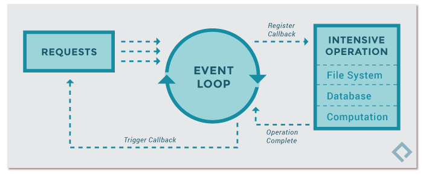

## 开始

FastAPI是一个用于构建API的现代、快速（高性能）的 web 框架

FastAPI中有两个核心组件

-   Starlette：负责web处理，基于AnyIO实现异步处理
-   Pydantic：负责执行数据校验

### Python异步

Python通过`asyncio`模块实现异步代码，底层只存在一个线程，asyncio是"多任务合作"模式，允许异步任务交出执行权给其他任务，等到其他任务完成，再收回执行权继续往下执行

asyncio模块在单线程上启动一个事件循环（event loop），时刻监听新进入循环的事件，加以处理，并不断重复这个过程，直到异步任务结束



### asyncio模块

asyncio模块配合`async`和`await`关键字使用

使用`async`关键字修饰一个函数，表示该函数是一个异步任务函数，使用`await`关键字调用一个异步任务函数，`await`只能在`async`函数中调用

```python
import asyncio
async def run_task():
    await asyncio.sleep(1)  # 休眠1秒
```

通过`asyncio.run()`函数来调用一个异步任务函数

```python
asyncio.run(run_task())
```

使用`asyncio.gather()`函数可以组合多个异步任务

```python
async def multi_task():
    await asyncio.gather(run_task(), run_task(), run_task())

asyncio.run(multi_task())
```

### 创建简单的FastAPI

```Python
from fastapi import FastAPI

app = FastAPI()

@app.get("/")
async def root():
    return {"message": "Hello World"}
```

使用`uvicorn main:app --reload`命令启动uvicorn服务器，默认在8000端口启动

访问`127.0.0.1:8000/docs`可以看到SwaggerUI生成的交互式API文档，访问`127.0.0.1:8000/redoc`可以看到ReDoc生成的可选的API文档

代码分析

1.   导入`FastAPI`类，`FastAPI`类提供了API的所有功能
2.   创建`FastAPI`的实例`app`，应用的所有API对通过`app`来创建和管理
3.   创建路径操作函数，使用`@<app_name>.<operation>(path)`装饰器来定义一个路径操作函数，满足该路径的请求会通过该函数处理
     -   `<app_name>`为创建的FastAPI实例的变量名
     -   `<operation>`为请求操作，同HTTP操作相同，如`@app.get`、`@app.post`、`@app.put`、`@app.delete`
     -   path为路径字符串，以`/`开头，`/`表示根路径

## 请求处理

### API参数

