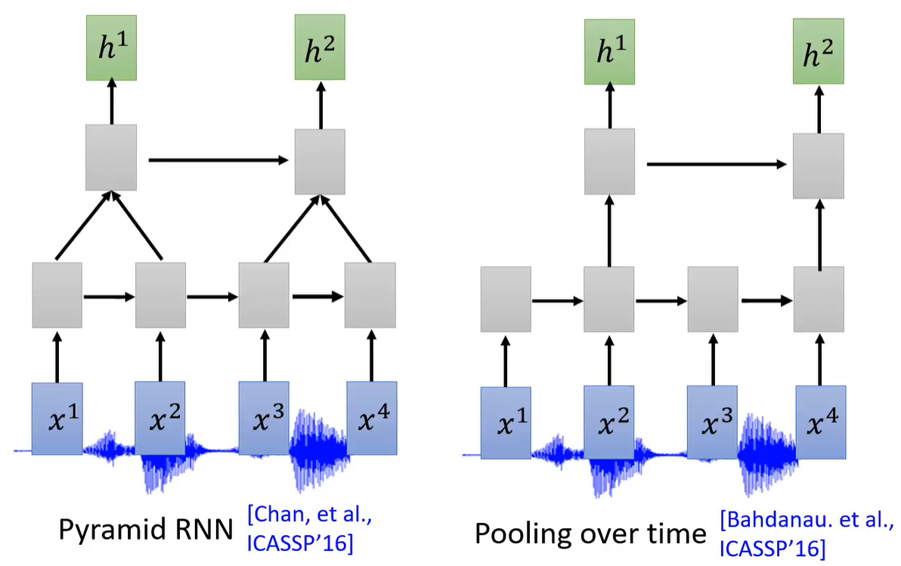
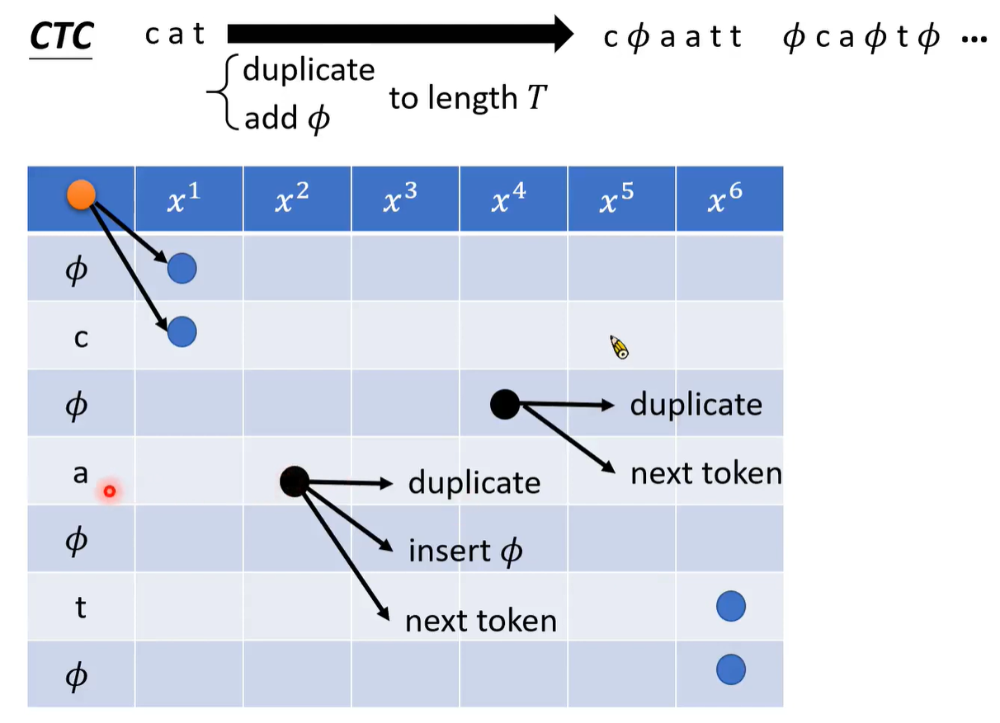

## 开始

自然语言处理的六种模型

-   语音-文字：语音识别
-   文字-语音：语音合成
-   语音-语音：语音分离、声音转换
-   文字-文字：机器翻译、问答
-   语音-类别：关键词识别、语者识别
-   文字-类别

## 语音识别

传统语音识别问题使用HMM算法，目前大部分模型是使用深度学习的seq2seq模型

对于seq2seq模型，输入的声音被表示成多个向量，输出的文字表示成一串token

token有两种类型

-   phoneme：语音中具有语义的最小单位称为音素（phoneme），将语音转换成音素后，通过词典（lexicon）映射到词语
-   grapheme：书写系统中的最小单位称为字素（grapheme）
-   word：词语
-   morpheme：词素，词语中具有意义的最小单位

语音处理

-   filter bank output
-   MFCC
-   spectrogram
-   waveform

### LAS模型

LAS全称为Listen,Attend and Spell，分为Listen，Attend和Spell三步，Listen相当于Encoder，Spell相当于Decoder

#### Listen

Listen部分输入一串语音向量，输出一串长度相同的向量，目标是提取内容特征，去除语者差异和噪声

Listen部分常用的模型有RNN，1-D CNN，Self Attention

下采样：输入的语音向量通常非常长，而相邻的语音特征差异较小，因此为了减小计算量，可以输出长度较短的向量，常用的模型有Pyramid RNN，Pooling over time，TDNN，Truncated Self-Attention

TDNN在一定范围内只考虑首尾两个向量，Truncated Self-Attention考虑一定范围内的向量，超过该范围就不考虑

#### Attend

Attend部分使用一个$z_0$向量，与每个Listen的输出匹配

匹配的具体方式有Dot-product Attention，Additive Attention

Dot-product Attention将h和z向量经过线性层$W^h$和$W^z$，得到两个向量，再将两个向量点乘

Additive Attention将h和z向量经过线性层后相加，得到一个向量，经过$\tanh$激活后，再经过一个线性层

得到一串$\alpha$向量后，经过一个Softmax，得到$\hat\alpha$，将$\hat\alpha$向量与h向量进行点乘，得到$c^0$，$c^0$称为Context Vector

#### Spell

Spell部分通常使用RNN

#### Beam Search

在Spell输出token时，每次都选择概率最大的一个输出，称为Greedy Decoding，可能会导致陷入局部极小

使用Beam Search，每次保留B个最好的结果

### CTC模型

CTC模型中只有一个Encoder，经过Encoder后输入到Classifier输出token，可以实现在线学习

由于每次输入的特征，信息量通常很小，因此CTC引入了null作为token，每次输入一个特征，若无法识别则输出null，最终输出是一串包含null的token，此时将重复的token合并，再去除null得到最终的输出

### RNN-T

对一个Encoder输出特征，输入到RNN中输出多个token，直到输出null，之后再输入下一个特征，null作为分隔符，最终输出一定包含T个null

### alignment

CTC与RNN-T在训练时输入的标签中不包含null，而模型直接输出中包含null，此时无法得知null应该位于输出向量的哪个位置

CTC与RNN-T的解决方法就是穷举出所有可能的组合，将所有位于组合中的输出的概率相加

$$
P(Y\vert X)=\sum\limits_{h\in align(Y)}P(h\vert X)
$$

穷举组合可以使用一个图来表示，左上角为起点，右下角为终点，所有从起点到达终点的合法路径表示一个组合

对于CTC

-   处在null状态时，可以重复这个null，也可以跳到下一个token状态
-   处在token状态时，可以重复这个token，或者插入一个null，也可以跳到下一个token状态
-   若存在相邻的相同token，则处在token状态时，不可以跳到下一个token状态

对于RNN-T

-   输出一定包含T个null
-   最后一个token一定是null

对于一条合法路径，处于每个状态时都有一定概率选择其中下一个的状态的其中一个，则该**路径的概率$P(h\vert X)$为路径上所有路径选择的概率之积**

定义一个变量$\alpha_{i,j}$表示输入第i个语音特征，输出第j个token时，所有穷举组合的分数总和，有

$$
\alpha_{i,j}=\alpha_{i,j-1}p(token)+\alpha_{i-1,j}p(null)
$$

经过一个递归过程，就可以计算出所有穷举组合的分数之和$P(Y\vert X)$

## 声音转换

声音转换系统输入一段语音，输出另一段语音，通常语音内容相同

有监督的声音转换：用两种不同风格的声音说相同的一段话，模型上比较容易实现，难点在于数据获取，可以使用预训练的模型或者进行数据生成

无监督的声音转换：用两种声音说不同的话

### Feature Disentangle

Feature Disentangle是一种将语音特征分为内容特征和语者特征两个部分，使用Content Encoder提取内容特征，使用Speaker Encoder提取语者特征，Decoder将两个特征融合起来

Decoder部分与AutoEncoder类似，而Encoder部分有一些不同的做法

-   使用one-hot向量代替语者特征，不需要训练Speaker Encoder
-   使用预训练的Speaker Encoder获取语者特征
-   使用语音识别系统作为Content Encoder

可以在Encoder中设计一些模块来实现相应特征的提取

在Content Encoder中添加instance normalization来去除语者特征，instance normalization在同一个特征维度上进行标准化，若某个特征包含语者特征，则会与其他特征出现明显差异，通过标准化可以去除这种差异

Decoder部分添加一个AdaIN，将Speaker Encoder的输出通过两个transform产生$\gamma$和$\beta$，将$\gamma$和$\beta$与Decoder经过IN后的输出融合起来

### Direct Transformation

使用Cycle GAN，输入一段X的语音特征，转换成Y的语音特征，通过Discriminator来判定输出和实际Y的特征的相似度，保证输出与Y相似，同时将输出再转换成X，判断与原始输入X的相似度，保证输出的内容与X相似

## 语音分离

语音分离可以分为两类

-   Speech Separation：将特定声音从噪声中分离，降噪
-   Speaker Separation：将不同语者的声音分离

Permutation issue：在模型生成两段语音后，无法得知哪一段语音对应哪个语者，从而不知道使用哪个语者的语音来计算loss

### 性能度量

-   SNR：Signal-to-noise ratio
    $$
    SNR=10\log_{10}\frac{\vert\vert X\vert\vert^2}{\vert\vert X-\hat X\vert\vert^2}
    $$

-   SI-SDR：X越平行于$\hat X$，值越大
    $$
    \begin{aligned}
    X_T&=\frac{\hat X\cdot X}{\vert\vert X\vert\vert^2}X\\
    X_E&=X-X^T\\
    SISDR&=10\log_{10}\frac{\vert\vert X_T\vert\vert^2}{\vert\vert X_E\vert\vert^2}
    \end{aligned}
    $$

### Deep Clustering

将生成语音变成生成mask，将原始语音与mask点乘即可得到对应的语音

将声音特征通过Embedding Generation后再经过K-means聚类，在训练时就是训练Embedding Generation，使得相同语者的Embedding相似，不同语者的Embedding不相似

### Permutation Invariant Training

PIT是一种解决Permutation issue的训练方法，首先将标签随机排列，让模型训练一次，更新参数后，根据当前模型来重新确定标签的排列，使得loss最小，之后再继续训练，不断循环这个过程

### TasNet

TasNet分为Encoder、Separator和Decoder三个部分，Encoder产生一个Feature map，Separator产生两个mask，将它们点乘后经过Decoder产生输出

Encoder和Decoder都是线性模型，两者不需要inverse

Separator是很多层dilated convolution的堆叠，经过dilated convolution后经过线性变换和sigmoid，输出两个mask

## 语音合成

### Tacotron

Tacotron是一个end2end的语音合成模型

Encoder部分

Decoder部分

