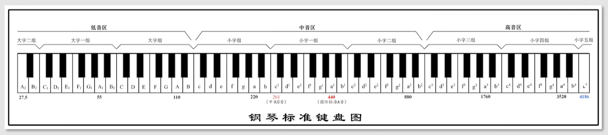
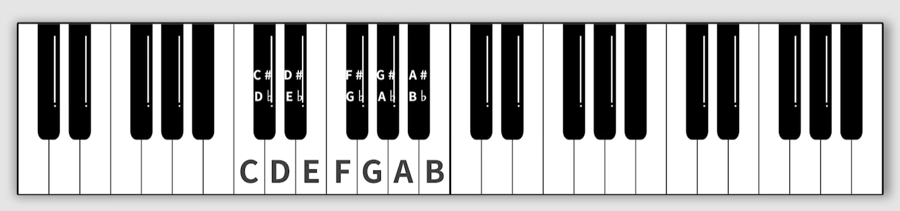
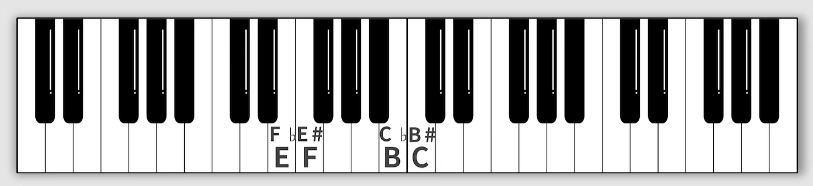
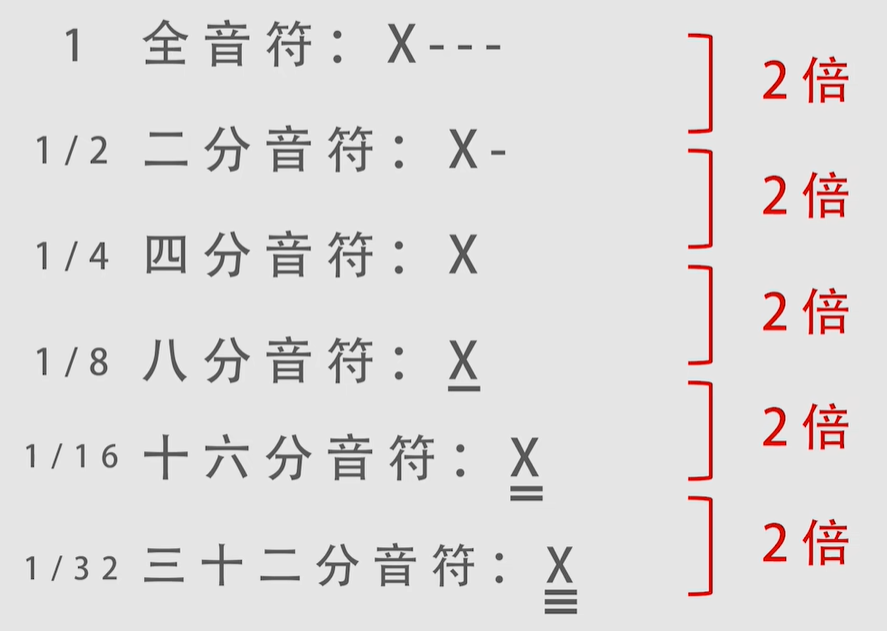
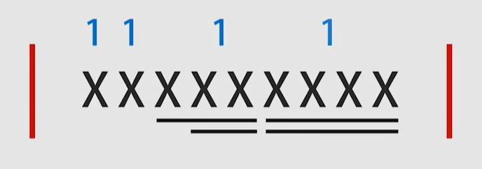
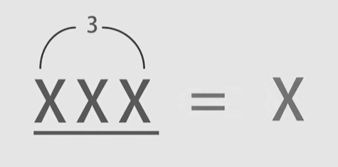

## 钢琴键盘

钢琴键盘共88个键，去掉左侧的三个键和右侧的一个键，将剩下的键划分为7个组，**每个组有7个白键和5个黑键**

音名：对每个组的白键，从左到右依次命名为C、D、E、F、G、A、B

半音和全音：在白键中相邻音的关系称为半音，只有E和F，B和C是半音关系，其他白键都是全音关系，黑键都是全音关系

黑键根据相邻的白键来命名，例如C右边的黑键称为升C，同时它也处于D的左边，也称为降D

对于E和F、B和C之间，也可用升降来表示，这种情况称为等音

## 时值和拍号

常见音符时值

以常见的44拍为例

44拍写成4/4，表示以四分音符为一拍，每小节有4拍，一个小节用小节线`|`来分割

每个小节中的音符时值可以不一样，但时值总和是相等的，例如2个四分音符+1个八分音符+6个十六分音符

BPM：表示每分钟节拍数，则每个拍子的时间(s)=60/BPM

## 附点音符和三连音

附点音符附在其他音符上，表示延长该音符时值的一半，写作$\underline X\cdot$

三连音是指将一个音符的时值均分为三份，例如将四分音符分为三份，就是八分音符三连音

## 调式

