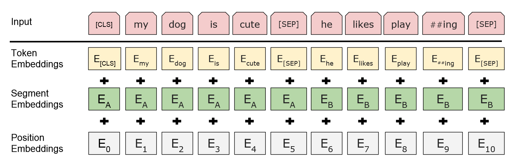
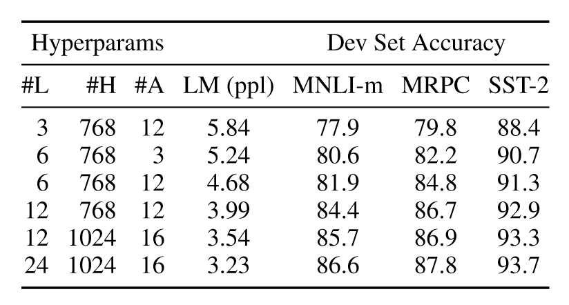

| 基本信息                                                     |
| ------------------------------------------------------------ |
| **期刊**: （发表日期: 2019-05-24）                           |
| **作者**: Jacob Devlin; Ming-Wei Chang; Kenton Lee; Kristina Toutanova |
| **摘要翻译**:我们介绍了一种新的语言表示模型，称为BERT，它表示从转换器的双向编码器表示。与最近的语言表示模型(Peters等人,2018a;雷德福等人,2018年)不同，BERT旨在通过对所有层中的左右上下文进行联合条件化来预训练来自未标记文本的深层双向表示。因此，只需一个额外的输出层就可以对预训练的BERT模型进行微调，从而为问答和语言推理等广泛的任务创建最先进的模型，而无需对特定任务的体系结构进行实质性的修改。BERT在概念上简单，在经验上有力。在11个自然语言处理任务上取得了新的前沿成果，包括将GLUE得分提升至80.5%(7.7%的绝对改善)，MultiNLI准确率提升至86.7%(4.6%的绝对改善)，SQuADv1.1问答测试F1提升至93.2(1.5分绝对改善)，SQuADv2.0测试F1提升至83.1(5.1分绝对改善)。 |
| **期刊分区**:                                                |
| **原文PDF链接**: [BERT: Pre-training of Deep Bidirectional Transformers for Language Understanding](https://arxiv.org/abs/1810.04805) |

## 摘要

*   bert是一个预训练的模型，通过联合左右的上下文信息来学习双向的表示
*   只需要添加额外的输出层并微调bert参数即可在多数任务上取得良好的效果
*   bert在11个NLP任务上取得了最好的效果

## 前言及文献综述

### Introduction

预训练模型可以提升很多任务的性能

*   sentence-level：句子段落关系
*   token-level：实体命名识别、问答

应用预训练模型的两类策略

*   feature-based：基于任务特征，根据特定任务构造任务相关的网络，将训练好的特征作为额外特征输入到模型中
*   fine-tuning：基于微调，在预训练模型上添加额外的输出层，在训练时联合微调预训练参数和输出层参数

目前预训练模型的局限：模型是单向的，导致架构选择上有局限，bert使用MLM来解决单向局限

MLM：随机地掩盖输入的token，目标是通过上下文预测被掩盖的token

### Related Work

*   Unsupervised Feature-based Approaches：词嵌入、ElMo
*   Unsupervised Fine-tuning Approaches：GPT
*   Transfer Learning from Supervised Data

## 结论

最近通过语言模型的迁移学习得到的经验改进表明，丰富的、无监督的预训练是许多语言理解系统的组成部分。特别地，这些结果使得即使是低资源任务也能从深度单向架构中获益。我们的主要贡献是将这些发现进一步推广到深层的双向架构中，使相同的预训练模型能够成功地处理广泛的NLP任务

## 方法

主要步骤

*   预训练：在无监督数据上对不同的预训练任务进行训练
*   微调：使用预训练的参数初始化模型，在有监督的数据上对不同的下游任务微调参数

***

模型架构

L表示层数，H表示隐层大小，A表示多头自注意力个数

*   BERT-BASE：L=12, H=768, A=12
*   BERT-LARGE：L=24, H=1024, A=16

***

输入和输出表示

bert输入为一个句子或一对句子的一个连续token表示

WordPiece embeddings

*   每个输入表示的第一个token为\[CLS]

*   分词

    *   使用\[SEP]分隔每个单词或句子
    *   对每个token学习一个segment embedding，指出token属于哪个句子

*   最终输入表示为token embedding、segment embedding和position embedding之和

### 预训练

使用Masked LM和NSP两个任务来预训练bert

***

Masked LM

标准的语言模型只能训练出单向的表示（left-to-right或right-to-left），因此使用Masked LM（MLM）来训练出双向表示，即在整个token序列中随机掩盖token，然后预测被掩盖的token，在实验中选择了15%的token进行掩盖

进行掩盖后，在预训练和微调之间产生了不匹配，因为在微调过程中被标记为\[MASK]的token不会出现，所以在处理被标记为\[MASK]的token时，使用三种策略

*   有80%概率替换为\[MASK]
*   有10%概率替换为随机的token
*   有10%概率保持不变

***

Next Sentence Prediction（NSP）

为了训练一个理解句子关系的模型，我们预训练了一个可以从任何单语语料中生成二值化的NSP任务

在选择样本的句子对(A, B)时，B句子有50%概率选择为A句子的下一个句子，有50%概率选择随机选择一个句子，经过训练后，\[CLS]产生的表示被用于NSP任务

在之前的工作中，只有token embedding被转移到下游任务中，而bert转移所有参数来初始化下游任务模型参数

### 微调

对于每个任务，只需将特定于任务的输入和输出插入bert并端到端地微调所有参数

输入到bert的句子对(A, B)可以是以下四种形式

*   段落中的句子对
*   假设-前提
*   问题-短文
*   文本-空（文本分类、序列标注）

在输出时，token的表示被输入到一个输出层，该输出层用于token-level的任务，如序列标注、问答，\[CLS]的表示被输出到一个输出层，用于分类任务

## 实验

### GLUE

在输出层使用线性变换，损失函数使用标准分类损失$\log softmax(CW^T)$

### SQuAD v1.1

引入起始向量S和结束向量E，对于单词i，它是答案段落起点或结束的概率为

$$
\begin{aligned}
PS_i&=\frac{e^{S\cdot T_i}}{\sum_j e^{S\cdot T_j}}\\
PE_i&=\frac{e^{E\cdot T_i}}{\sum_j e^{E\cdot T_j}}
\end{aligned}
$$

其中，$T_i$表示第i个token产生的表示，对于一个答案序列(i, j)，它的分数为

$$
Score=S\cdot T_i+E\cdot T_j
$$

选择分数最高的序列作为预测的答案序列

### SQuAD v2.0

### SWAG

### 消融实验

#### 预训练任务的影响

`No NSP`：在预训练时不训练NSP任务

`LTR & No NSP`：使用标准的LTR（left-to-right）模型训练，同时在微调时应用left-only约束，不训练NSP任务

`LTR & No NSP + BiLSTM`：在LTR的基础上添加双向LSTM提取右侧信息

#### 模型大小的影响

使用不同数量的层、隐层单元和注意力头，更大的模型在所有四个数据集上都有明显的精度提升

如果模型经过充分的预训练，扩展到极端大小的模型也会带来小规模任务的大幅改进

#### BERT基于特征的方法

不是所有的任务都可以适用Transformer Encoder架构，此时需要根据任务设计特定的网络结构，即使用基于任务特征的方法。预训练模型产生的表示同样可以在特定任务中发挥作用，同时可以减小计算成本

在CoNLL-2003数据集上进行NER任务，在使用基于特征方法时，不微调bert参数，将一个或多个层的输出嵌入提取出来，将这些嵌入进行组合后输入到一个随机初始化的两层BiLSTM中，之后再进行分类

## 创新点

*   双向上下文理解

    在BERT之前的模型如GPT是单向的，即它们只考虑来自左边或右边的上下文，而BERT引入了双向的方式，在训练过程中同时考虑左右两边的上下文

*   MLM

    BERT引入了MLM作为预训练目标，在MLM中，一些输入的词汇会被随机掩盖，模型的训练目标是基于上下文预测这些被掩盖的词，这使得模型能够学习深层的双向表示，不同于传统的从左到右或从右到左的语言模型