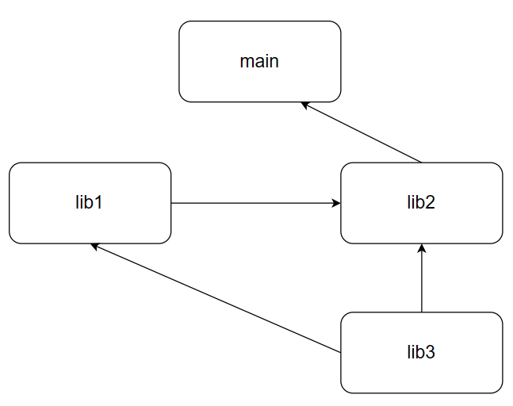

## 开始

CMake是一个跨平台的开源构建系统工具，旨在简化软件项目的构建过程

通过使用简单的配置文件（CMakeLists.txt），CMake能够生成标准化的构建文件（如Makefile或Visual Studio工程文件），使得开发者可以在不同的平台和编译器上方便地管理项目构建

## CMakeLists语法

CMake依赖`CMakeLists.txt`文件来构建

### 变量

获取变量：`${variable_name}`

变量有预定义变量和自定义变量

预定义变量：获取环境变量`$ENV{variable}`

设置变量：`set()`、`unset()`

- `set(variable_name value1 value2)`，传入多个值时作为一个list
- `unset()`：销毁变量

设置和销毁环境变量

- `set(ENV{varaible} value)`
- ``unset(ENV{varaible})`

列表操作

创建列表

-   `set(list_name value1 value2)`
-   `list(APPEND list_name value1 value2)`
-   `list(APPEND <list> [<element>...])`：列表添加元素
-   `list(REMOVE_ITEM <list> <value>[value...])`：列表删除元素
-   `list(LENGTH <list> <output variable>)`：获取列表元素个数
-   `list(FIND <list> <value> <out-var>)`：在列表中查找元素返回索引
-   `list(INSERT <list> <index> [<element>...])`：在`index`位置插入
-   `list(REVERSE <list>)`：反转列表
-   `list(SORT <list>[...])`：排序列表

### 流程控制

if-else

``` cmake
if (<condition>)
	<commands>
elseif (<condition>)
	<commands>
else()
	<commands>
endif()
```

for循环

```cmake
foreach(<loop_var> RANGE <max>)
    <commands>
endforeach()

foreach(<loop_var> RANGE <min> <max> [<step>])
    <commands>
endforeach()

foreach(<loop_variable> IN [LISTS <lists>] [ITEMS <items>])
    <commands>
endforeach()
```

while循环

```cmake
while(<condition>)
    <commands>
endwhile()
```

### 函数

```cmake
function(func_name arg1 arg2)
	commands
endfunction()

function(func2 arg1)
	# 一个参数时也可传入多个参数
	# ${ARGV0}、${ARGV1}、${ARGV2}获取
endfunction()

func2(${variable})
```

-   `project(name c cxx)`：指定工程名和支持的语言，该关键字同时声明了两个变量，`<project_name>_BINARY_DIR`和`<project_name>_SOURCE_DIR`，可以使用统一的`PROJECT_BINARY_DIR`和`PROJECT_SOURCE_DIR`
-   `message("message")`：在终端输出信息

### 作用域

-   Function作用域
-   Directory作用域：父文件夹中CMakeLists的变量可以在子文件夹CMakeLists中使用

### 宏

```cmake
macro(macro_name arg...)
	commands
endmacro()
```

## 构建

-   在项目文件夹下创建build文件夹，进入build文件夹，`cmake ..`创建工程，编译的临时文件会在build文件夹中
-   调用子目录的cmake脚本：使用`include`导入子目录的cmake文件，可以使用其中的变量
-   `add_subdirectory`：在父目录中添加直接子目录，识别子目录中的cpp

生成目标

-   `add_executable`：生成可执行文件，在最顶层目录将main.cpp生成可执行文件
-   `add_library`：生成库文件，包含所有cpp

添加头文件搜索路径

- `target_include_directories`：在特定目标中添加头文件路径，在cpp中include时不需要从当前相对路径开始

  包含在该目标中的所有源文件都共享该路径

- `include_directories`：当前目录中的所有目标及其子目录中的目标共享该路径

链接库

-   `target_link_libraries`：将通过`add_library`生成的库链接到目标

e.g

在`main`目录中包含`lib1`和`lib2`两个目录，在`lib2`中包含`lib3`目录，`lib1`和`lib2`引用`lib3`，`lib2`引用`lib1`，`main`引用`lib2`



``` cmake
# 目录关系
add_subdirectory(lib1)
add_subdirectory(lib2)

add_executable(main main.cpp)

# 引用关系
target_include_directories(main PUBLIC ./lib2)
target_link_libraries(main PUBLIC lib2)
```
{: file=“main/CMakeLists.txt” }

```cmake
# 目录关系
add_subdirectory(lib3)

add_library(lib2 lib2.cpp)

# 引用关系
target_include_directories(lib2 PUBLIC ../lib1)
# target_include_directories(lib2 PUBLIC ./lib3)
target_link_libraries(lib2 PUBLIC lib1)
target_link_libraries(lib2 PUBLIC lib3)
```

{: file=“lib2/CMakeLists.txt” }

```cmake
add_library(lib1 lib1.cpp)

# 引用关系
target_include_directories(lib1 PUBLIC ../lib2/lib3)
target_link_libraries(lib1 PUBLIC lib3)
```
{: file=“lib1/CMakeLists.txt” }

```cmake
add_library(lib3 lib3.cpp)
```
{: file=“lib3/CMakeLists.txt” }

## 库

静态库：在编译时将库一起链接打包到可执行文件中，后缀为`.a`/`.lib`

动态库：在运行时将目标库链接到程序中，后缀为`.so`/`.dll`

-   `file`：搜索源文件
-   `add_library(STATIC)`：生成静态库
-   `add_library(SHARED)`：生成动态库
-   `${LIBRARY_OUTPUT_PATH}`：设置库的导出目录

