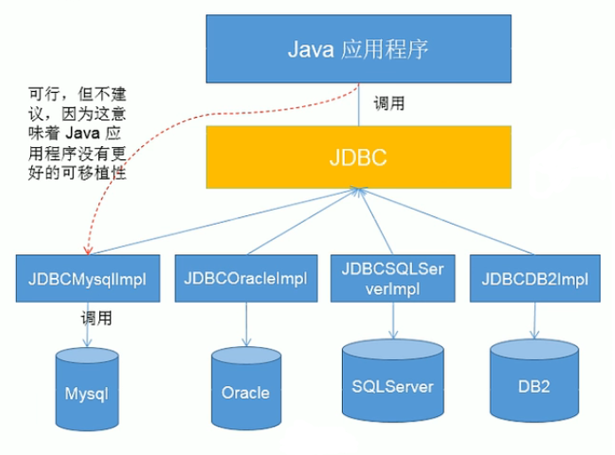

## 开始

JDBC是java操作数据库的一组API

JDBC只是java操作数据库的接口，具体的实现由数据库厂商实现各自的驱动



## 数据库连接

使用数据库首先要与数据库进行连接，JDBC有多种方式可以连接到数据库

### Driver

通过java的Driver抽象类连接，使用具体数据库驱动的driver对象实例化

传入url，properties，调用connect返回连接对象

url格式：`jdbc:mysql://ip:3306/database_name`

properties对象调用`setProperties()`，传入账号密码的键值对

### 反射连接

使用反射将连接过程封装

```java
Class<?> cl = Class.forName("com.mysql.cj.jdbc.Driver");
Driver driver = (Driver) cl.getDeclaredConstructor().newInstance();
```

### DriverManager

DriverManager可以管理多个Driver对象，可以通过DriverManager获取连接

```java
DriverManager.registerDriver(driver);
Connection connection = DriverManager.getConnection(url, properties);
```

### 类加载

driver对象在类加载时，会自动注册

```java
Class.forname("com.mysql.cj.jdbc.Driver"); // 加载类
Connection connection = DriverManager.getConnection(url, properties); // 直接获取连接
```

## 操作数据库

jdbc中有三个接口定义了数据库的调用

-   Statement：执行静态的SQL语句，容易产生SQL注入问题
-   PreparedStatement：将SQL语句预编译后存储在对象中，可用于多次高效地调用
-   CallableStatement：用于执行SQL存储过程

ORM思想

-   一张表对应一个Java类
-   一条记录对应一个Java对象
-   一个字段对应一个Java对象的属性

### PreparedStatement

调`connection.preparedStatement(sql)`获取preparedStatement对象

传入的sql语句支持动态参数，使用?占位

调用`preparedStatement.setXXX(index, value)`设置动态参数，**index从1开始**，再调用`execute()`执行

在sql语句中若表名为关键字，则使用\`\`着重符将表名括起来

### 查询结果操作

调用`executeQuery()`返回一个ResultSet对象

处理结果集

-   `resultSet.next()`：判断下一条是否有数据
-   `resultSet.getXXX(index)`：获取字段
-   `resultSet.getMetaData()`：返回结果集的元数据，可以获取列数、列名

对于一个任意字段数量的对象的查询

```java
public static Book queryBook(String sql, Object... args) {
    Book book = null;
    try {
        // 设置查询
        PreparedStatement statement = connection.prepareStatement(sql);
        for (int i = 0; i < args.length; i++) {
            statement.setObject(i + 1, args[i]);
        }

        // 查询并处理结果集
        ResultSet resultSet = statement.executeQuery();
        ResultSetMetaData metaData = resultSet.getMetaData();
        int col = metaData.getColumnCount();
        if (resultSet.next()) {
            book = new Book(); // 不知道book的字段
            for (int i = 0; i < col; i++) {
                Object value = resultSet.getObject(i + 1);

                // 数据库列名与book字段名相同
                // 若不相同，在查询的SQL语句中使用as给查询的字段取别名
                // 在获取列名时，调用getColumnLabel()返回别名
                // String label = metaData.getColumnName(i + 1);
                String label = metaData.getColumnLabel(i + 1);
                Field field = Book.class.getDeclaredField(label);
                field.setAccessible(true);
                field.set(book, value);
            }

        }
    } catch (SQLException | NoSuchFieldException | IllegalAccessException e) {
        throw new RuntimeException(e);
    }
    return book;
}
```

### 操作BLOB类型字段

BLOB类型为二进制长文本数据

mysql支持四种容量的BLOB

-   TinyBlob：255B
-   Blob：65KB
-   MediumBlob：16MB
-   LongBlob：4GB

Blob类型的参数需要传入一个InputStream对象，即需要存入的图片的输入流

读取Blob类型

```java
String type = metaData.getColumnTypeName(i + 1);
// 在通用类型中判断Blob类型
if ("BLOB".equals(type) ||
    "MEDIUMBLOB".equals(type) ||
    "TINYBLOB".equals(type)) {
	
    // 构造文件名并向对象的filename字段写入文件名
    int id = resultSet.getInt("id");
    String filename = "p" + id + ".jpg";
    Field field = cl.getDeclaredField("filename");
    field.setAccessible(true);
    field.set(t, filename);

    // 读取文件，下载到本地
    Blob value = resultSet.getBlob(i + 1);
    InputStream inputStream = value.getBinaryStream();

    // 使用Lombok注解@Cleanup
    try (FileOutputStream outputStream = new FileOutputStream(filename)) {
        byte[] buffer = new byte[1024];
        int len;
        while ((len = inputStream.read(buffer)) != -1) {
            outputStream.write(buffer, 0, len);
        }
    }
}
```

### 批量插入

mysql默认不支持批处理，需要在URL中传入参数开启批处理

```url
jdbc:mysql://localhost:3306/db?rewriteBatchedStatements=true
```

批处理相当于构造多条语句并执行

操作流程

-   在构造完一条语句后(设置完动态参数后)，调用`preparedStatement.addBatch()`将该语句存入一批中
-   调用`preparedStatement.executeBatch()`执行当前批
-   调用`preparedStatement.clearBatch()`清空当前批
-   在循环中可以控制批数
-   在数据库层面可以关闭自动提交，构成一层缓存，调用`connection.setAutoCommit(false)`
-   在语句全部执行完后，调用`connection.commit()`提交到数据库

## 事务

### 基本概念

事务是数据库的一组操作，具有ACID属性

-   原子性：事务要么全部操作成功，要么全部失败
-   一致性：事务提交前后，数据库的状态必须保持一致
-   隔离性：多个事务并发时，事务操作之间互不干扰
-   持久性：一旦事务提交，事务造成的数据库变化是持久的

数据库自动提交

-   DDL：对表结构的增删改，一定会提交
-   DML：对记录的增删改，默认自动提交，可设置`autocommit = false`取消自动提交
-   默认在关闭连接时自动提交

设置事务

1.   取消自动提交，`connection.setAutoCommit(false);`
2.   在捕获异常中调用`connection.rollback();`回滚
3.   在所有操作执行成功后调用`connection.commit();`提交
4.   在操作结束后，若连接没有关闭则应该重新设置自动提交`connection.setAutoCommit(true);`

基本流程

```java
connection.setAutoCommit(false);
try {
    executeStatements;
    connection.commit();
} catch (Exception e) {
    connection.rollback();
}
```

### 数据库并发

设两个事务T1，T2

-   脏读：T1读取了T2已经更新但未提交的数据，此时T2回滚，T1读取的数据无效(脏数据)
-   不可重复读：T1读取了一个字段，此时T2更新了该字段，T1再读取该字段，前后读取数据不一致
-   幻读：T1读取一个表，此时T2向该表插入了记录，T1再读取该表，结果多了几条记录

隔离级别

-   READ UNCOMMITTED：允许读取未被其他事物提交的变更，安全性最低
-   READ COMMITTED：只允许事物读取其他事物已经提交的变更
-   REPEATABLE READ：在事务执行期间，禁止其他事务对当前事务读取的字段进行更新
-   SERIALIZABLE：类似同步，性能最低

相关API

-   调用`connection.getTransactionIsolation()`获取隔离级别
-   调用`connection.setTransactionIsolation()`设置隔离级别

## DAO

DAO是Data Access Object，数据库操作对象，里面封装了操作数据库的方法

DAO操作规范

-   定义抽象父类BaseDAO，实现一个通用的DAO对象
-   对于具体的表，定义相应的DAO接口，指明需要实现的方法
-   实现相应的DAO接口并继承BaseDAO，将对象转换到SQL并调用BaseDAO

>   中间的实现类DAO层将对象与SQL语句隔离开，调用方只考虑操作对象，BaseDAO只考虑操作SQL
{: .prompt-info }

## 数据库连接池

为所有数据库连接建立一个缓冲池，需要建立连接时，从连接池中取出连接使用，允许程序重复使用连接，降低建立连接开销

### Druid连接池

配置文件jdbc.properties

```properties
url=jdbc:mysql://localhost:3306/maxdb?rewriteBatchedStatements=true&useUnicode=true&characterEncoding=utf8
username=root
password=020411
driverClassName=com.mysql.cj.jdbc.Driver

initialSize=5
```

在JDBCUtils中创建连接池

```java
private static DataSource source;

static {
    Properties properties = new Properties();
    try {
        @Cleanup
        InputStream is = ClassLoader.getSystemClassLoader().getResourceAsStream("jdbc.properties");
        properties.load(is);
        source = DruidDataSourceFactory.createDataSource(properties);
    } catch (Exception e) {
        e.printStackTrace();
    }
}

Connection connection = source.getConnection();
```

## Apache-DBUtils

Apache封装的数据库操作库

###QueryRunner

QueryRunner中一共有6种方法

-   execute（执行SQL语句）
-   batch（批量处理语句）
-   insert（执行INSERT语句）
-   insertBatch（批量处理INSERT语句）
-   query（SQL中SELECT语句）
-   update（SQL中INSERT,UPDATE或DELETE语句）

### ResultSetHandler

ResultSetHandler是处理查询结果的处理器

-   BeanHandler：将一条结果封装为对象，若查询结果有多条，则返回第一条记录的对象
-   BeanListHandler：将多条结果封装为对象列表
-   ArrayHandler：将一条结果的字段作为数组元素，一条结果作为一个数组返回
-   ArrayListHandler：将多条结果封装为数组列表
-   MapHandler：将一条结果的标签作为key，字段值作为value，返回一条结果的构成的map
-   MapListHandler：返回多条结果的map列表
-   ScalerHandler：用于封装特殊值，如count，max

### 关闭资源

```java
DBUtils.close(connection);
// 等效于
if (connection != null) {
    connection.close();
}

DBUtils.closeQuietly(connection);
// 等效于
try {
    DBUtils.close(connection);
} catch(SQLException e) {
    // quiet
}
```

