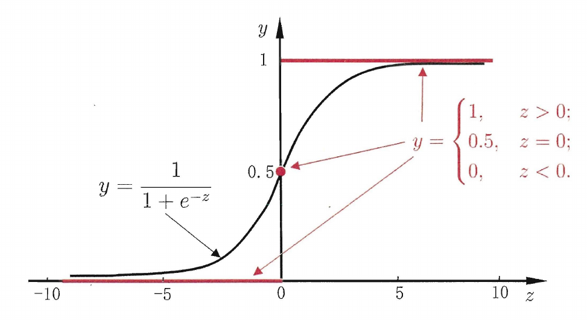
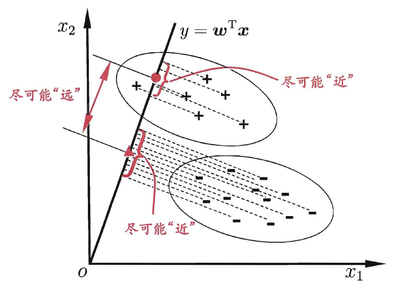
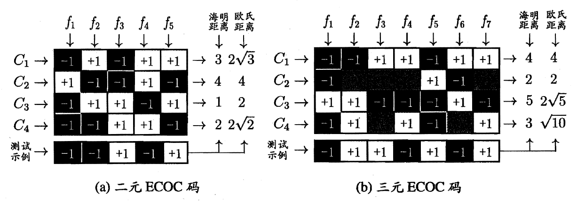

## 基本形式

对样本$x=(x_1;x_2;x_3;...;x_d)$，有

$$
f(x_i)=\omega^Tx+b
$$

其中$\omega=(\omega_1;\omega_2;...;\omega_d)$

## 线性回归

离散属性处理

-   具有序关系的属性可以连续化，如身高
-   不具有序关系的属性转化为k维向量

### 一元线性回归

对于一元线性回归

$$
f(x_i)=\omega x_i+b
$$

使用均方误差来衡量$f(x)$与$y$​的差别，并使其最小化来求解模型的方法称为最小二乘法

最小二乘参数估计

$$
\begin{aligned}
E(\omega,b)&=\sum\limits_{i=1}^m(f(x_i)-y_i)^2\\
\frac{\partial E(\omega,b)}{\partial \omega}&=2(\omega\sum\limits_{i=1}^mx_i^2-\sum\limits_{i=1}^m(y_i-b)x_i)\\
\frac{\partial E(\omega,b)}{\partial b}&=2(mb-\sum\limits_{i=1}^m(y_i-\omega x_i))
\end{aligned}
$$

令两个偏导为0可求得$\omega$和$b$最优解

### 多元线性回归

对于多元线性回归

$$
f(x_i)=\omega^T x_i+b
$$

定义向量形式如下

$$
\begin{aligned}
X&=\begin{bmatrix}
x_{11} & x_{12} & \cdots & x_{1d} & 1\\
x_{21} & x_{22} & \cdots & x_{2d} & 1\\
\vdots & \vdots & \ddots & \vdots & \vdots\\
x_{m1} & x_{m2} & \cdots & x_{md} & 1\\
\end{bmatrix}=\begin{bmatrix}
\vec{x}_1^T & 1\\
\vec{x}_2^T & 1\\
\vdots & \vdots\\
\vec{x}_m^T & 1\\
\end{bmatrix}\\
\hat{\omega}&=(\vec{\omega},b)\\
\vec{y}&=(y_1;y_2;...;y_m)
\end{aligned}
$$

由最小二乘法有

$$
\begin{aligned}
E(\hat{\omega})&=(\vec{y}-X\hat{\omega})^T(\vec{y}-X\hat{\omega})\\
\frac{\partial E(\hat{\omega})}{\partial \omega}&=2X^T(X\hat{\omega}-\vec{y})
\end{aligned}
$$

当$X^TX$满秩时，令偏导为0有唯一解，也称为正规方程法

$$
\hat\omega=(X^TX)^{-1}X^T\vec y
$$

当$X^TX$不满秩时，存在多组解，由算法的归纳偏好决定输出哪一组解，通常引入正则化项

广义线性模型

$$
y=g^{-1}(\omega^Tx+b)
$$

其中函数$g(.)$单调可微，称为联系函数，可以理解为将线性模型的预测值与实际标记联系起来的函数

## 对数几率回归

对于二分类任务，使用线性模型需要将线性模型的输出值与分类联系起来

使用sigmoid函数作为联系函数

$$
y=\frac{1}{1+e^{-z}}
$$

sigmoid函数将$(-\infty,+\infty)$映射到$(0,1)$之间

代入线性函数有

$$
\begin{aligned}
y&=\frac{1}{1+e^{-(\omega^Tx+b)}}\\
\ln\frac{y}{1-y}&=\omega^T+b
\end{aligned}
$$

其中$\ln\frac{y}{1-y}$​称为对数几率（logit），反映了正例的相对几率

将$y$重写为概率估计，通过极大似然估计可求解参数

$$
\begin{aligned}
p(y=1\vert x)&=\frac{e^{\omega^Tx+b}}{1+e^{\omega^Tx+b}}\\
p(y=0\vert x)&=\frac{1}{1+e^{\omega^Tx+b}}
\end{aligned}
$$

## 线性判别分析

在二分类问题上，线性判别分析（LDA）通过将样本投影到一条直线上，同时使得相同类别的样本的投影点尽可能接近，而不同类别的样本的投影点尽可能远离，确定直线后，将新样本投影到该直线上，根据投影点的位置判定类别

LDA的目标是使同类样本的投影点尽可能接近，则可以使同类样本投影点的协方差尽可能小，使不同的样本的投影点尽可能远离，则可以使类中心的距离尽可能大，用$\mu_0$和$\mu_1$表示两类样本的均值向量，$\Sigma_0$和$\Sigma_1$表示两类样本的协方差矩阵，有最大化目标函数

$$
J=\frac{\omega^T(\mu_0-\mu_1)(\mu_0-\mu_1)^T\omega}{\omega^T(\Sigma_0+\Sigma_1)\omega}=\frac{\omega^TS_b\omega}{\omega^TS_\omega\omega}
$$

## 多分类学习

对于多分类问题，通常是使用一些拆分策略，将其转换为多个二分类问题，通常有以下三种拆分策略

-   一对一（OvO）：将N个类别两两配对，形成$N(N-1)/2$组二分类问题，最终结果取预测最多的类别
-   一对其余（OvR）：将一个类别作为正例，其余类别作为反例，形成N个二分类问题
-   多对多（MvM）：取多个类别作为正例，其他类别作为反例，通常使用纠错输出码（ECOC）拆分

ECOC分为两步

-   编码：对N个类别做M次划分，划分出M个训练集，训练出M个分类器
-   解码：M个分类器分别对测试样本分类，产生的预测标记组成一个编码，将这个编码与每个类别定义的编码进行比较，将其中距离最小的类别作为结果

ECOC常见的有二元码和三元码，类别和类别划分组成编码矩阵，其中1表示正类，-1表示负类

a图中分类器f1的预测结果为$(-1,+1,-1,-1)$，f2的预测结果为$(+1,-1,+1,-1)$，f3的预测结果为$(-1,-1,+1,+1)$，f4的预测结果为$(+1,+1,-1,+1)$，f5的预测结果为$(+1,-1,+1,-1)$，对于C1类别组成了一个编码$(-1,+1,-1,+1,+1)$，使用该编码与测试样本的编码进行比较

对于同一个学习任务，一般编码越长，纠错能力越强，但编码越长，所需的分类器越多，训练开销越大

## 类别不平衡问题

类别不平衡是指分类任务重不同类别的训练样本数目差别很大，同时在使用OvR和MVM拆分多分类问题时也可能导致类别不平衡

使用再缩放策略解决类别不平衡问题

通常认为正反例的可能性相同，当正例几率大于0.5时预测为正例

$$
\frac{y}{1-y}>1
$$

当正反例的数目不同时，假设训练集是真实样本集的无偏采样，当正例几率大于数据集中正例的观测几率就可以判为正例

$$
\frac{y}{1-y}>\frac{m^+}{m^-}
$$

对预测值进行再缩放调整

$$
\frac{y'}{1-y'}=\frac{y}{1-y}\times\frac{m^-}{m^+}
$$

实际操作中观测几率通常不能代表真实几率，此时使用三种方法处理

-   多数样本欠采样：删除多数样本
-   少数样本过采样：通常使用插值增加样本
-   阈值移动：将再缩放方法加入决策过程中
