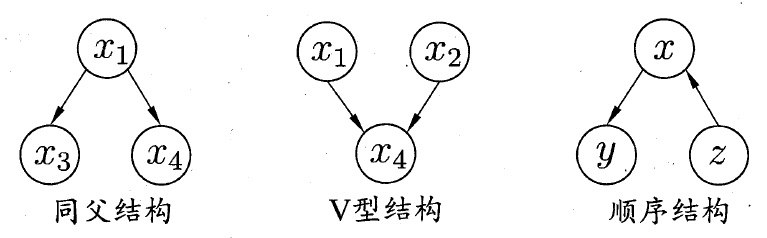
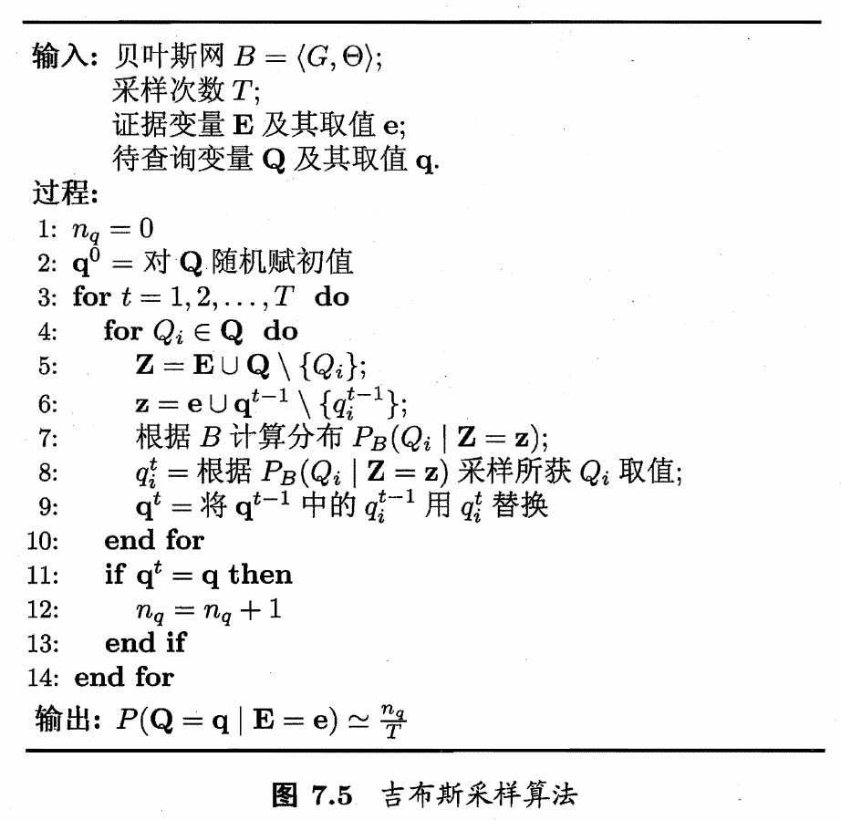

## 贝叶斯决策论

贝叶斯判定准则：为最小化总体风险，只需在每个样本上选择那个能使条件风险最小的类别标记

$$
h^*(x)=\arg\min\limits_{c\in\Upsilon}R(c\vert x)
$$

$h^*(x)$称为贝叶斯最优分类器，对应的总体风险称为贝叶斯风险

贝叶斯判定准则基于后验概率$P(c\vert x)$，根据贝叶斯定理有

$$
P(c\vert x)=\frac{P(c)P(x\vert c)}{P(x)}
$$

其中$P(c)$可以根据各类样本出现的频率进行估计

## 极大似然估计

估计类条件概率$P(x\vert c)$的常用策略是先假定其具有某种确定的概率分布，再基于训练样本对概率分布的参数进行估计

令$D_c$为训练集D中第c类样本的集合

$$
\begin{aligned}
P(D_c\vert\theta_c)&=\prod\limits_{x\in D_c}P(x\vert\theta_c)\\
L(\theta_c)&=\ln P(D_c\vert\theta_c)=\sum\limits_{x\in D_c}\ln P(x\vert\theta_c)\\
\hat\theta_c&=\arg\max\limits_{\theta_c}L(\theta_c)
\end{aligned}
$$

## 朴素贝叶斯分类器

朴素贝叶斯分类器假设**所有属性相互独立**，则有

$$
\begin{aligned}
P(c\vert x)&=\frac{P(c)P(x\vert c)}{P(x)}=\frac{P(c)}{P(x)}\prod\limits_{i=1}^dP(x_i\vert c)\\
h_{nb}(x)&=\arg\max\limits_{c\in\Upsilon}P(c)\prod\limits_{i=1}^dP(x_i\vert c)
\end{aligned}
$$

当某个属性值在训练集中没有与某个类同时出现过，即使通过其他属性可以判定为正类，依然会被判为负类，此时需要进行拉普拉斯修正

$$
\begin{aligned}
P(c)&=\frac{\vert D_c\vert+1}{\vert D\vert+N}\\
P(x_i\vert c)&=\frac{\vert D_{c,x_i}\vert+1}{\vert D_c\vert+N_i}
\end{aligned}
$$

## 半朴素贝叶斯分类器

半朴素贝叶斯分类器与朴素贝叶斯不同在于**不需要要求属性之间全部相互独立，适当考虑一部分强相关的属性依赖**

属性之间的依赖关系可以构建出树或者图，从而使用相关的算法来选择属性依赖

独依赖估计（ODE）是半朴素贝叶斯分类器最常用的一种策略，它假设每个属性在类别之外最多仅依赖于一个其他属性

$$
P(c\vert x)\propto P(c)\prod\limits_{i=1}^dP(x_i\vert c,pa_i)
$$

SPODE算法假设所有属性都依赖于同一个属性，再通过交叉验证等模型选择方法来确定超父属性

TAN算法在属性依赖构成的树结构上，使用最大生成树算法，选择强相关的属性依赖

AODE是一种基于集成学习机制、更为强大的独依赖分类器，它尝试将每个属性都作为超父来构建SPODE，最后将那些具有足够训练数据支撑的SPODE集成起来作为最终结果

## 贝叶斯网

贝叶斯网借助DAG图来描述属性之间的依赖关系，使用条件概率表来描述属性间的联合概率分布

### 结构

贝叶斯网中有三种典型的结构，分别是同父结构、V型结构和顺序结构

使用有向分离来分析贝叶斯网

1.   找出图中所有的V型结构，在V型结构的两个父节点之间加上一条无向边
2.   将所有的有向边改为无向边

经过以上处理产生的无向图称为道德图，该过程称为道德化

在道德图中，若节点x和y能被z分开，即去除z节点后，x和y属于两个连通分支，则称属性x和y被z有向分离

### 学习

若网络结构已知，则只需对训练样本计数，估计出每个节点的条件概率即可，因此在学习之前，首先要找到结构最合适的贝叶斯网，使用评分搜索来解决这个问题，定义一个评分函数，评估贝叶斯网和训练集的契合程度，基于这个评分函数来寻找结构最优的贝叶斯网

常用的评分函数基于信息论的准则，寻找一个能与数据契合的长度最短的编码，定义评分函数为以下形式

$$
\begin{aligned}
s(B\vert D)&=f(\theta)\vert B\vert-LL(B\vert D)\\
LL(B\vert D)&=\sum\limits_{i=1}^m\log P_B(x_i)
\end{aligned}
$$

其中，$\vert B\vert$表示贝叶斯网B的参数个数，$f(\theta)$表示描述每个参数$\theta$所需的编码位数

当$f(\theta)=1$，函数称为AIC评分函数，当$f(\theta)={1\over2}\log m$，函数称为BIC评分函数

### 推断

直接根据贝叶斯网定义的联合概率分布来精确计算后验概率是一个NP难问题，通常使用吉布斯采样来求得近似解

设经过T次采样得到与q一致的样本共有$n_q$个，则估计后验概率为

$$
P(Q=q\vert E=e)\simeq\frac{n_q}{T}
$$

吉布斯采样的每一步依赖于前一步的状态，这是一个马尔可夫链，在一定条件下，在$t\rightarrow\infty$时必收敛于一个平稳分布

## EM算法

EM算法用于估计参数隐变量，即在样本属性存在缺失值时进行参数估计

以参数初始值$\Theta_0$为起点，迭代以下步骤直到收敛

-   E步：基于$\Theta^t$推断隐变量Z的期望，记为$Z^t$
-   M步：基于已观测变量$X$和$Z^t$对参数$\Theta$做极大似然估计，记为$\Theta^{t+1}$

