| 基本信息 |
| :----------------------------------------------------------- |
| **期刊**:（发表日期: 2023-01-12） |
| **作者**: Chen Gao; Yu Zheng; Nian Li; Yinfeng Li; Yingrong Qin; Jinghua Piao; Yuhan Quan; Jianxin Chang; Depeng Jin; Xiangnan He; Yong Li |
| **摘要翻译**:推荐系统是当今互联网上最重要的信息服务之一。近年来，图神经网络已经成为推荐系统的新方法。在本次调查中，我们对基于图神经网络的推荐系统的文献进行了全面的综述。我们首先介绍了推荐系统和图神经网络的背景和发展历史。对于推荐系统，一般来说，对现有工作的分类有四个方面：阶段、场景、目标和应用。对于图神经网络，现有的方法分为两类，谱模型和空间模型。然后，我们讨论了将图神经网络应用于推荐系统的动机，主要包括高阶连通性、数据的结构特性和增强的监督信号。然后，我们系统地分析了图构建、嵌入传播/聚合、模型优化和计算效率等方面的挑战。之后，我们首先按照上述分类方法，对基于图神经网络的推荐系统的大量现有工作进行了全面的综述。最后，我们对该领域的开放问题和未来发展方向进行了讨论。我们总结了其中的代表性论文及其代码库。[GNN-Recommender-Systems](https://github.com/tsinghua-fib-lab/GNN-Recommender-Systems) |
| **期刊分区**:                                               |
| **原文PDF链接**:[A Survey of Graph Neural Networks for Recommender Systems: Challenges, Methods, and Directions](https://arxiv.org/abs/2109.12843) |

## 摘要

推荐系统目前工作的四个方面

*   stage
*   scenario
*   objective
*   application

GNN目前分为两种方法

*   spectral models
*   spatial ones

GNN-based recommender system挑战

*   图结构
*   嵌入传播和聚合
*   模型优化
*   计算效率

## 前言及文献综述

推荐系统定义：推荐系统是一种过滤系统，它的目标是向用户展示个性化的信息，从而提升用户体验和提高业务利润

经典推荐系统的四个方面

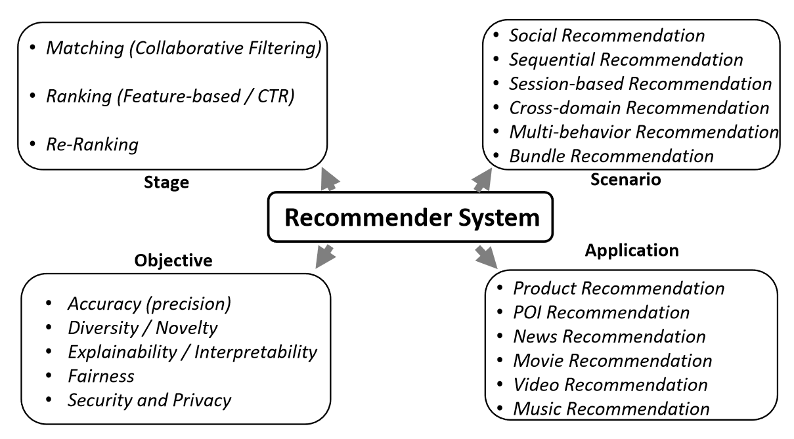

推荐系统的三个历史阶段

*   shallow models
*   neural models
*   GNN-based models

***

shallow models

直接计算交互的相似度来获取协同过滤效应，后来发展出基于模型的CF方法，如矩阵分解（MF）、因子分解机（FM）

> 协同过滤效应：“those items that are interacted with by other users with similar preferences are also relevant to the user, which is known as the collaborative filtering effect”

弊端：难以处理复杂的用户行为和数据输入

***

neural models

NCF：neural collaborative filtering，使用MLP扩展了MF中的矩阵內积操作

DeepFM：deep factorization machine，将MLP与FM结合

弊端：受到预测范式局限性的限制，在训练上忽略了数据中的高阶结构信息

预测范式的局限性：基于用户已经交互过的item来预测，无法包含未交互过的item

***

GNN-based models

GNN采用embedding propagation迭代地聚合相邻的嵌入。通过堆叠传播层，每个顶点可以访问高阶邻居信息，而不是像传统方法那样只访问一阶邻居信息

GNN遇到的挑战

*   数据应该被正确处理，使其可以被GNN的节点和边理解
*   GNN的各个组件应该可以针对特定任务进行适应性设计
*   GNN的优化应该与任务要求一致
*   GNN的embedding propagation引入了大量的计算，但推荐系统对计算成本有严格的限制，导致难以将GNN部署到推荐系统

***

文章结构

1.  从stage、scenario、objective和application四个方面介绍推荐系统的背景，介绍GNN的背景
2.  从四个方面介绍GNN应用在推荐系统的挑战
3.  按照分类介绍GNN-based推荐系统的代表性方法
4.  讨论重要的开放性问题以及提出未来方向的想法
5.  结论

## 结论

图神经网络模型在推荐系统研究领域发展迅速。本文提供了一个广泛的调查，系统地介绍了这一领域的挑战，方法和未来的方向。不仅对发展的历史，而且对最新的进展都有很好的涵盖和介绍。我们希望这项调查能够对相关领域的初级和有经验的研究人员提供帮助

## 背景

### 推荐系统

#### Stage（阶段）

一般的推荐系统使用多阶段的架构，将item从item pool中一个阶段一个阶段地过滤

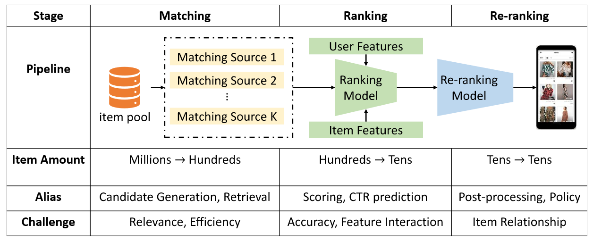

一般有三个阶段，分别是Matching、Ranking、Re-ranking

*   Matching：该阶段从巨大的item pool中求候选的item

    特点：该阶段需要处理大量数据，同时由于在线服务有严格的延迟限制，使用的模型通常比较简单

    核心任务：高效地检索出潜在相关的item，实现用户兴趣的粗粒度建模

*   Ranking：将来自不同Matching阶段的多个来源的候选item合并成一个列表，然后通过单一的排序模型进行评分，选出排名前列的item

    特点：该阶段需要处理的item较少，因此可以使用复杂的算法

    核心任务：设计合适的模型来捕获复杂的交互特征

*   Re-ranking：删除某些项目或改变列表的顺序，以满足额外的标准，满足业务需求

    特点：经过Ranking后的item在相关性方面已经得到优化，但在其他的方面可能不符合需要，如时效性，多样性和公平性等

    核心任务：考虑item之间的多种关系

#### Scenario（场景）

推荐系统应用场景一般有社交推荐、序列推荐、会话推荐、捆绑推荐、跨域推荐、多行为推荐

*   社交推荐

    由于社交效应（个体的行为同时受到个人和社交的影响），社交关系通常被整合到推荐系统中，称为社交推荐

*   序列推荐

    用户通常随时间产生大量的交互行为，序列推荐则根据这个交互行为序列（item序列）来预测用户的下一个交互的item

    两个挑战

    *   需要提取每个序列的信息来预测下一个item，当序列非常长时，难以同时构建用户短期、长期和动态的兴趣
    *   item可能出现在多个序列中或者用户可能产生多个序列，因此需要捕获序列之间的协同信息

*   基于会话的推荐（SBR）

    用户信息和用户长期行为可能难以获取，只能获取到匿名用户提供的短期信息，因此需要根据匿名用户的短期行为来预测下一个item

    由于用户总是基于当前会话来交互，同一个用户的每个会话处理事相互独立的

*   捆绑推荐

    不同之前的推荐系统只向用户推荐独立的item，捆绑推荐向用户推荐一个相关的item集合

*   跨域推荐（CDR）

    跨域推荐用于解决冷启动和数据稀疏的问题，利用多个领域的信息可以提高性能，可以大致分为single-target CDR和dual-target CDR

    CDR方法将源域的信息单向传递到目标域，dual-target CDR强调源域和目标域信息的相互利用，它可以扩展到multiple-target CDR

*   多行为推荐

    用户可能对同一个item进行多种类型的交互，需要提高对其中某种行为预测准确率

    两个挑战

    *   不同的行为对目标行为的影响不同，且这种影响在用户之间也是不同的，因此难以精确构建不同行为对目标行为的影响关系
    *   难以从不同行为中学习到对于item的全面的表示，不同的行为有不同的意义，需要把行为意义整合到表示学习中

#### Objective（目标）

*   Diversity（多样性）

    两个挑战

    *   不同item的信号强度差异很大，长尾item的信号强度远远弱于流行item
    *   多样性和准确性可能产生矛盾

    Diversity有两种类型

    *   individual-level diversity：衡量单个用户推荐item的差异性
    *   system-level diversity：衡量不同用户推荐item的差异性

*   Explainability（可解释性）

    可解释性推荐系统的关注点不仅在于产生准确的推荐结果，还在于解释item如何以及为什么被推荐给用户

    提升可解释性的两种方法

    *   使用透明的逻辑来设计模型，而不是黑箱，如Explicit Factor Models、Hidden Factor and Topic Model、Tri-Rank
    *   使用额外的模型来解释黑箱模型产生的结果，如Explanation Mining

*   Fairness（公平性）

    不同的数据和算法导致推荐系统有偏好

    Fairness有两类

    *   user fairness：保证算法对每个用户都是公平的
    *   item fairness：保证每个item的推荐是公平的

    增强公平性的方法

    *   在训练过程中直接使用无偏好的推荐结果
    *   在后处理时对item进行排序来缓解不公平性

#### Application（应用）

*   Product recommendation
*   POI(Point of Interest) recommendation
*   News recommendation
*   Movie recommendation

### GNN

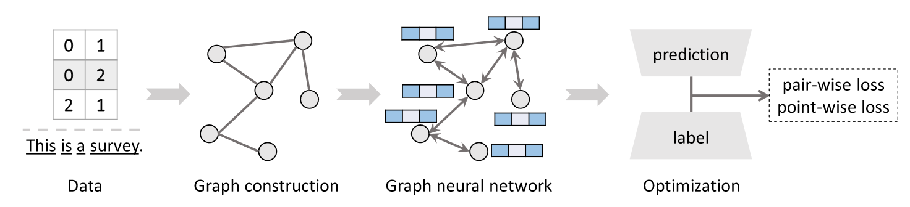

#### 图结构

GNN基于三种图来设计网络

*   Homogeneous graph（同构图）：每条边只连接两个顶点，顶点和边只有一种类型
*   Heterogeneous graph（异构图）：每条边只连接两个顶点，顶点和边有多种类型
*   Hypergraph（超图）：每条边连接两个以上的顶点

隐式社交媒体关系可以被认为是一个统一的图，节点代表个体，边连接彼此关注的人。由于图像、文本等非结构化数据不明确包含图，因此需要手动定义节点和边来构建图

*   在NLP中，定义words/document为顶点，边通过IF-ITF构建
*   在知识图谱（KG）中，定义顶点为实体，边为关系

构建图要么需要预先存在的图数据，要么需要从非结构化数据中抽象出图节点和边的概念

#### 网络设计

GNN模型可以分为谱模型和空间模型

相同点：通过迭代地收集邻域信息（embedding）来捕获图节点和边之间的高阶相关性

*   谱模型：首先通过定义在图上的傅里叶变换将图信号变换到谱域，然后施加滤波器，最后将处理后的信号变换回空间域

    $$
    g\star x=F^{-1}(F(g)\odot F(x))
    $$

*   空间模型：空间模型直接对图结构进行卷积，通过加权聚合的方式提取局部特征，如CNN

GNN主要操作：按照结构连接在图上传播嵌入，包括聚合邻域嵌入并将其与目标(节点或边)嵌入融合以逐层更新图嵌入

***

经典GNN

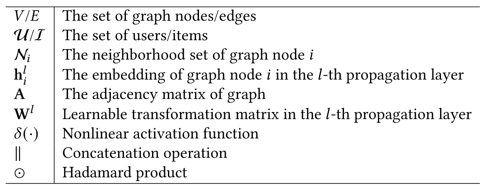

*   GCN：典型的谱模型，它结合了图卷积和神经网络来实现半监督分类的图任务。具体来说，GCN将卷积中的滤波器用一阶近似

    $$
    H^{l+1}=\delta(\tilde D^{-\frac{1}{2}}\tilde A\tilde D^{-\frac{1}{2}}H^lW^l)
    $$

    其中，A表示图的邻接矩阵，$D_{ii}=\sum_jA_{ij}$

*   GraphSAGE：空间模型，它采样目标节点的邻居节点，聚合它们的嵌入，并与目标嵌入合并更新

    $$
    \begin{aligned}
    h^l_{N_i}&=AGGREGATE_l(\{h^l_j,\forall j\in N_i\})\\
    h^{l+1}_i&=\delta(W^l[h^l_i\vert\vert h^l_{N_i}])
    \end{aligned}
    $$

    其中，AGGREGATE函数可以是MEAN、LSTM等

*   GAT：空间模型，利用注意力机制，通过对不同节点指定不同的权重来聚合邻域嵌入

    $$
    \begin{aligned}
    h^{l+1}_i&=\delta(\sum\limits_{j\in N_i}\alpha_{ij}W^lh^l_j)\\
    \alpha_{ij}&=\frac{\exp(LeakyReLU(a^T[W^lh^l_i\vert\vert W^lh^l_j]))}{\sum\limits_{k\in N_i}\exp(LeakyReLU(a^T[W^lh^l_i\vert\vert W^lh^l_k]))}
    \end{aligned}
    $$

*   HetGNN：空间模型，基于异构图，HetGNN根据顶点和边的类型将邻接点分成多个子集，对每个子集使用聚合函数，结合LSTM和MEAN操作来手机局部信息，之后将不同子集的信息通过注意力机制聚合起来

*   HGNN：基于超图实现的GNN谱模型

    $$
    H^{l+1}=D_v^{-\frac{1}{2}}ED_e^{-1}E^TD_v^{-\frac{1}{2}}H^lW^l
    $$

    其中，E中的$E_{iu}$表示超边u是否包含顶点i，$D_e$中的每一个对角线项表示顶点包含多少条超边，$D_v$中的每个对角线项表示超边包含多少个顶点

    卷积操作可以认为是传播邻域嵌入的两个阶段

    1.  从顶点到连接它们的超边传播
    2.  从超边传播到它们相遇的顶点

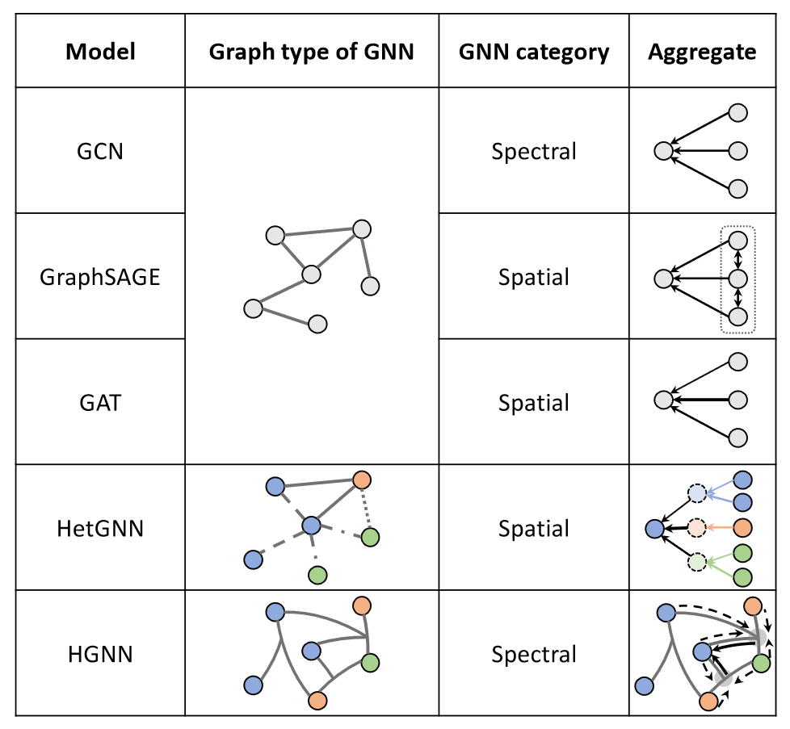

卷积或嵌入传播操作通常会执行多次，当小于4次时，GNN会出现过平滑问题，即当传播层数变大时，被更新的嵌入会出现小幅波动

#### 模型优化

GNN输出的嵌入需要根据不同的下游任务进行变换，交输出的相关嵌入进行映射并附带标签来构建损失函数，然后利用现有的优化器进行模型学习

有几种不同的损失函数

*   pair-wise：成对损失函数，BPR函数如下

    $$
    L=\sum\limits_{p,n}-\ln\sigma(s(p)-s(n))
    $$

    其中，$\sigma(\cdot)$表示sigmoid函数，$s(\cdot)$表示样本的度量，p,n表示正例样本和负例样本

*   point-wise：逐点损失函数，通常有MSE，Cross-Entropy

基于GNN的模型优化将GNN泛化的表示作为输入，图结构（例如,边,节点类）作为标签，并定义损失函数进行训练

### 为什么推荐系统需要GNN

*   结构化数据

    *   传统的推荐系统无法利用在线平台的多形式数据，通常只关注少许几个数据源
    *   GNN提供了利用数据的统一方式并且在学习表示上非常强大

*   高阶连接性

    *   传统推荐系统只能捕获交互记录中的一阶连接性，忽略了高阶连接性
    *   协同过滤效应可以自然地表示为多跳邻居顶点，它通过嵌入传播和聚合被整合到学习到的表示中

*   监督信号

    *   监督信号在采集的数据中通常是稀疏的，而基于GNN的模型可以在表示学习过程中利用半监督信号来缓解这一问题
    *   通过在图上设计辅助任务，可以利用自监督信号，进一步提高推荐性能

## 推荐系统应用GNN的挑战

应用GNN主要面临四个挑战

*   如何针对特定任务设计合适的图结构
*   如何设计信息传播和聚合的机制
*   如何优化模型
*   如何保证模型训练和推理的性能

### 构建图结构

主要步骤

*   将数据重建为图结构数据
*   将推荐的目标重新组织为图上的任务

设计要素

*   顶点

    顶点的表示很大程度上决定了模型的性能，其中大部分参数由第0层的顶点嵌入确定。通常要么不考虑边嵌入，要么基于节点嵌入计算

    顶点的挑战

    *   确定是否区分不同类型的顶点

    *   处理连续型数据

        将连续型数据转换为离散型数据，再用顶点表示

*   边

    边的定义很大程度上影响模型优化时传播和聚合的质量。在一些简单任务中，推荐系统的数据输入可以被认为是一种关系数据，例如user-item交互或者user-user社交关系，在一些复杂任务中，其他关系也可以表示为边，比如item与bundle的连接可以表示从属关系

    在构建图时，好的边设计应该充分考虑图的密度

    *   当图过于稠密时，导致传播的嵌入不具有区分度
    *   当图过于稀疏时，导致嵌入传播性能不高

### 网络设计

在传播方面，如何选择传播路径对于推荐系统中的高阶相似度建模至关重要。此外，传播也可以是参数化的，即对不同的顶点赋予不同的权重

有多种函数可以用于聚合，比如mean pooling、LSTM、max、min。由于在所有的推荐任务或不同的数据集中没有一个选择可以表现最好，因此设计一个特定的和合适的选择是至关重要的。此外，传播/聚合的不同选择极大地影响了计算效率

传播/聚合层可以堆叠以帮助节点访问更高跳数的邻居节点，过浅的层数导致模型无法构建高阶结构信息，过深的层数导致嵌入出现过平滑

### 模型优化

*   损失函数：为了优化基于图神经网络的推荐模型，推荐系统中传统的损失函数往往转变为图学习损失
*   样本采样：在基于GNN的推荐中，为了对正负项目进行采样，采样方式高度依赖于图结构
*   多任务：有时基于GNN的推荐可能涉及多个任务，如何平衡各项任务，使其相互促进，具有挑战性

### 计算效率

在现实世界中，推荐系统应该被高效地训练/推理。因此，为了保证基于GNN的推荐模型的应用价值，需要保证其计算效率

与传统的非GNN推荐方法相比，GNN的计算成本要高得多

通过在邻居之间进行采样或对图结构进行剪枝，可以减小一些计算成本，但也会造成推荐性能的下降，需要在二者之间权衡来保证效率

## 已有方法

### 分类

根据Stage分类

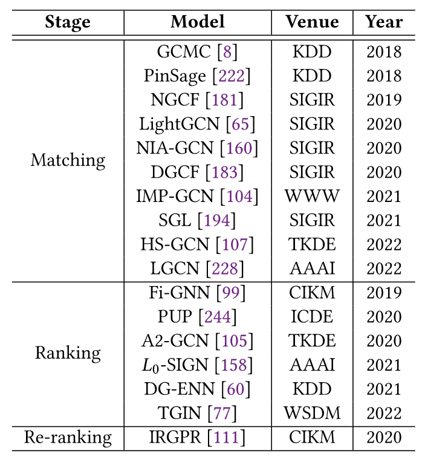

根据Scenario分类

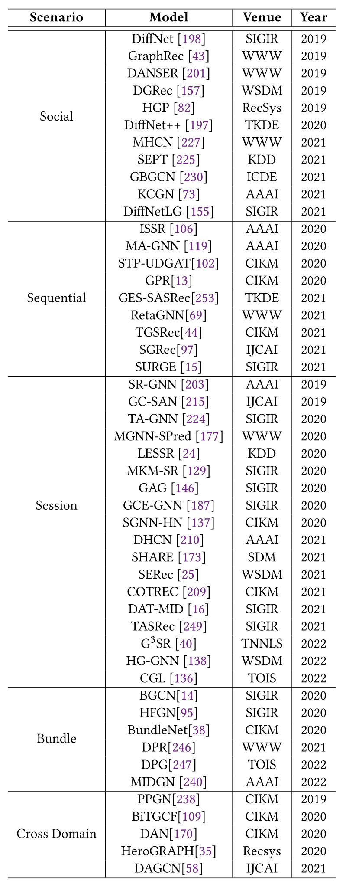

根据Objective分类

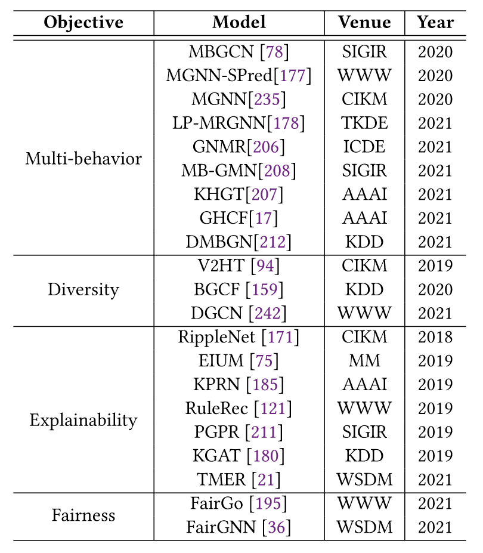

### Stage

#### Matching

在Matching阶段基于GNN的模型可以看作是嵌入匹配，通常在user-item二部图上设计专门的GNN架构

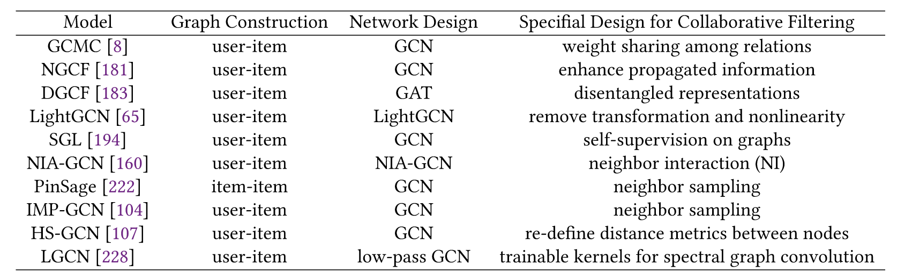

*   GCMC：通过求和传递邻域信息，为不同的关系边分配权重共享的转换通道
*   NGCF：相比MF和NCF取得了更优性能
*   NIA-GCN：认为简单的聚合机制如sum、mean或max不能构建邻居之间的关系信息，并提出了邻居交互感知卷积来解决这个问题
*   DGCF：开发了去纠缠GNN来捕获独立的用户意图，在Matching时扩展了候选item集合，同时保证了准确性
*   SGL：利用图结构的稳定性融入对比学习框架来辅助表示学习
*   PinSage：基于GNN的模型可以用于web规模的推荐系统，该模型在大规模item-item图上学习时，结合了random walk和Graph SAGE
*   LightGCN：去除了非线性操作来提升性能

#### Ranking

现有的Ranking模型通常先将稀疏特征转化为one-hot编码，再转化为稠密嵌入向量，将这些向量直接拼接，以非结构的形式输入到DNN或专门设计的模型中

基于GNN的排序模型通常由encoder和predictor两个组件组成，它们从不同的方向处理特征交互

*   设计特殊的图结构来捕获encoder中所需的特征交互
*   在predictor中可以考虑特征交互，通过集成来自encoder的不同特征嵌入来估计排名分数

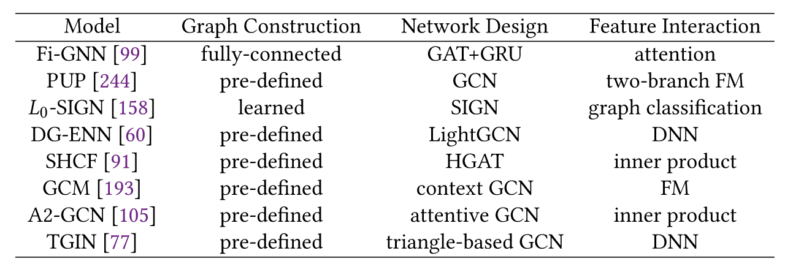

*   Fi-GNN：构建了一个加权的全连接图，使用GAT和GRU作为encoder，使用注意力网络实现predictor
*   PUP：研究了价格特征对Ranking的影响并提出了一种名为价格感知用户偏好建模的模型，在预定义的异构图上使用GCN作为encoder，使用两分支FM作为predictor
*   L0-SIGN：自动检测有用的特征交互，只保留这些边，产生一个学习得到的图，将这个图输入到图分类模型中估计Ranking分数
*   DG-ENN：提出了一个属性图和协作图的对偶图，它整合了不同领域的信息，以细化用于Ranking的嵌入
*   SHCF、GCM：使用额外的顶点和边属性来表示item的属性和上下文信息，SHCF使用inner product作为predictor，GCM使用FM作为predictor

#### Re-ranking

Re-ranking需要考虑两个因素

*   不同的item之间可以通过一定的关系相互影响，比如替代性和互补性
*   不同用户有不同的偏好，Re-ranking需要实现个性化

Re-ranking的主要挑战是如何融合多个Re-ranking目标

IRGPR：提出了一个异构图来融合两个信息源、一个item关系图来捕获多个item的关系以及一个user-item评分图来包含初始ranking分数，经过多个消息传播层后得到user和item的嵌入，包括全局item关系传播和个性化意图传播，最后通过一个前馈神经网络生成Re-ranking的输出顺序

### Scenario

#### 社交推荐

社交推荐有两个关键要素

*   如何捕获社交因素
*   如何将来自朋友的社交因素和来自互动行为的用户偏好结合起来

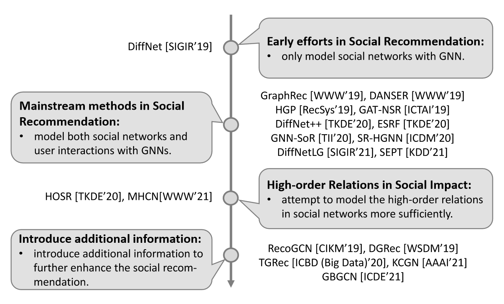

目前的工作从两个角度来捕获社交因素

*   图结构

    *   高阶关系

        *   考虑到普通图只能对成对关系进行建模，基于普通图的方法，将多个GNN层进行堆叠，以捕获多跳的高阶社交关系
        *   MHCN提出使用超边来构建高阶信息
        *   HOSR递归地传播嵌入来反映高阶邻居在用户表示中的影响

    *   边缘信息

        *   Reco GCN将用户、物品和销售代理统一到一个异构图中，以捕获社交电子商务中的复杂关系
        *   GBGCN构建了一个图来组织团购推荐中两个视图的用户行为，其中，initiator视图包含initiator-item交互，participant视图包含participant-item交互
        *   DGRec和TGRec将用户行为的时间信息引入到社交推荐中
        *   KCGN提出利用开发的知识感知耦合图同时捕获user-user和item-item关系

*   信息传播

    主要有两种传播机制，GAT和GCN

    *   Reco GCN在构建的图上进行基于元路径的GCN传播，以同时捕获社交影响和用户偏好
    *   HOSR使用GCN从邻居中聚合信息来捕获高阶关系
    *   MHCN使用GCN在超图上传播来获取高阶社交关系
    *   GraphRec和DiffNet++假设来自社交图上不同邻居的社交影响是不同的，并对来自不同朋友的社交影响赋予不同的权重

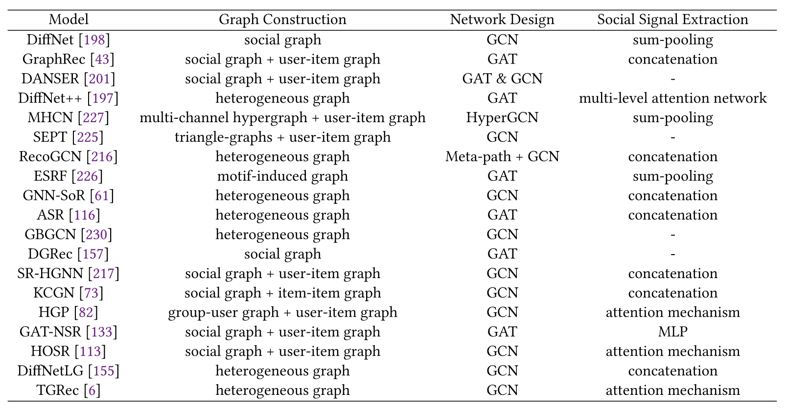

在社交推荐中，从两个不同的角度学习用户表示，即社交影响和用户交互，为了从这两种角度结合用户表示，有两种策略

*   分别从社交图和user-item二部图学习用户表示

    DiffNet、GraphRec和MHCN使用这种策略学习到两种用户表示后，使用sum-pooling、concatenation、MLP或注意力机制来结合两种用户表示

*   从由社交图和user-item二部图组成的统一图中联合学习用户表示

    DiffNet++使用这种策略，首先通过GAT机制聚合user-item子图和社交子图的信息，之后在每层使用多层注意力网络来结合表示

#### 序列推荐

对于序列推荐，为了提高推荐性能，需要从序列中提取尽可能多的有效信息，并学习序列中用户的兴趣，包括短期兴趣、长期兴趣、动态兴趣等，准确预测用户可能感兴趣的下一个item

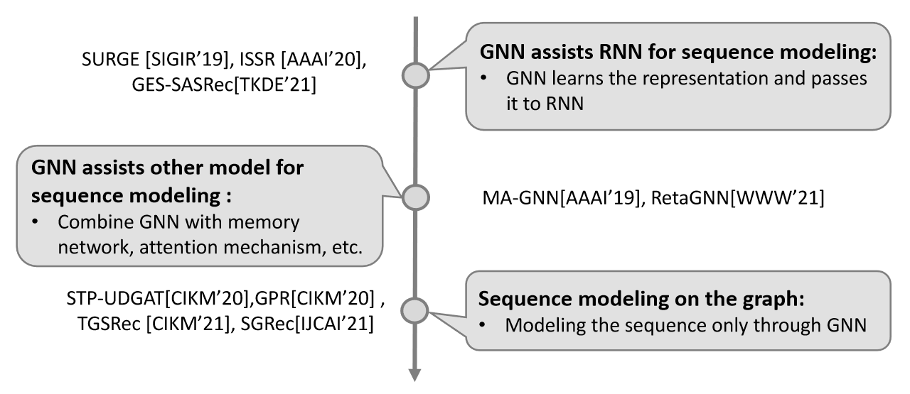

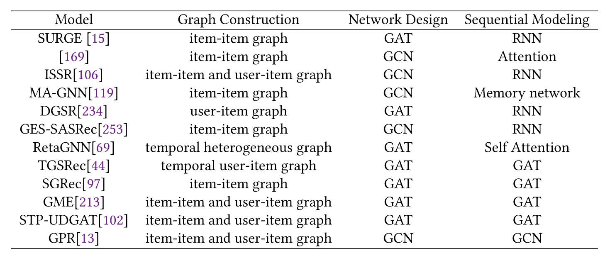

*   SURGE：将每个用户的序列转换成item-item图，并通过度量学习学习每条边的权重，通过dynamic graph pooling保留更强的边，通过位置展开将保留的图转换成一个序列，使用该序列预测下一个item
*   MA-GNN：考虑序列中的短期兴趣，构建一个item-item图，图中item只与在序列中与它相近的item建立边，最后将学习到的表示融合起来用于最终推荐

由于GNN具有聚合邻居顶点信息进行高阶关系建模的能力，将多个序列融合成一个图后，可以学习到用户和物品在不同序列中的表示

*   \[169]：直接将序列信息转换成有向边，使用GNN学习表示
*   ISSR：构建了一个user-item二部图和一个item-item图，其中item-item图的边表示连接的两个item在序列中同时出现，根据出现的次数分配边的权重。学习到的表示通过RNN用于最终的推荐
*   DGSR、TGSRec：在构建图时考虑序列中的时间戳，在user-item图中，边除了表示user和item的交互，还附带时间属性，对时序图进行卷积操作，学习用户和item的表示
*   GES-SASRec、SGRec：GES-SASRec考虑了当前item在其他序列的下一个item，SGRec不仅考虑下一个item还考虑前一个item，通过聚合不同序列中之前和之后的item来增强item的表示
*   GPR、GME：通过考虑连续出现或在同一序列中出现的频率来构建item之间的边

#### 基于会话推荐

在基于会话的推荐中，会话数据可能同时包含用户兴趣和噪声信号，需要考虑两个方面

*   如何对会话数据中的item转移模式进行建模
*   如何从嘈杂的数据中激活用户的核心兴趣

item转移可以被建模为图，在图上的信息传播可以激活用户的实际兴趣

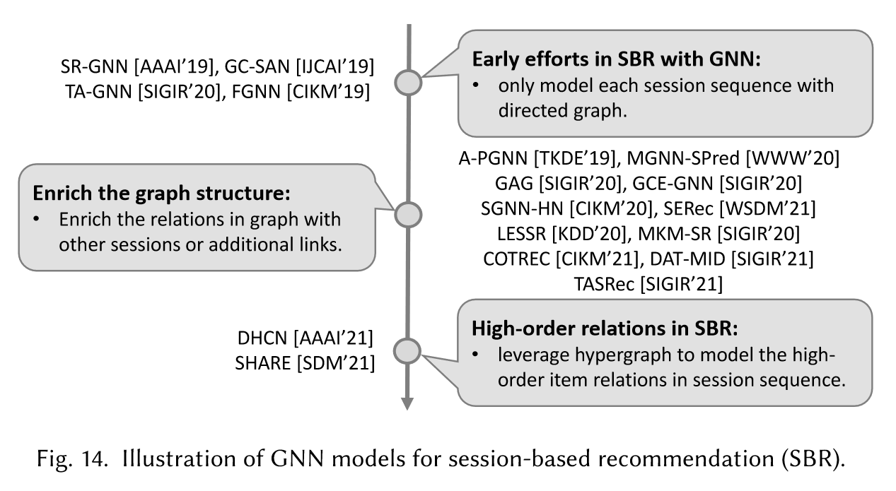

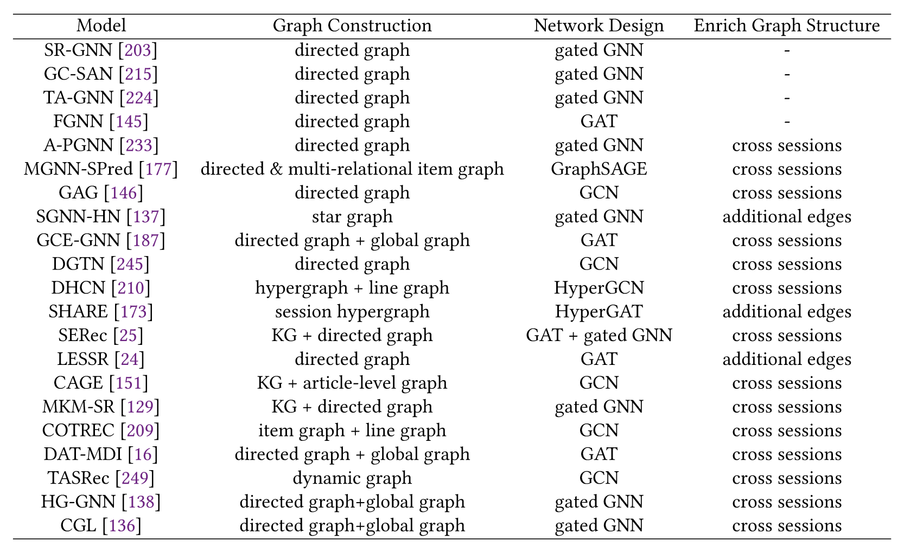

*   图结构

    基于会话的推荐中会话序列较短，用户行为受限

    有两种策略解决该问题

    *   从其他会话中直接捕捉关系

        *   A-PGNN、DGTN、GAG：增强当前会话图与相关会话的关系
        *   GCE-GNN：通过构建另一个全局图来利用全局上下文来辅助当前会话中的转移模式
        *   DHCN：将每个会话视为一个超边并表示超图中的所有会话，以建模高阶item关系
        *   SERec：通过知识图谱来增强每个会话的全局信息
        *   CAGE：通过利用开放的知识图谱来学习语义级别实体的表示，以改进基于会话的新闻推荐
        *   MKM-SR：通过结合用户微观行为和item知识图谱来增强给定会话中的信息
        *   COTREC：从item视图将所有会话统一为一个全局item图，从会话视图通过线图捕获会话之间的关系
        *   DAT-MID：遵循GCE-GNN构建会话图和全局图，然后学习来自不同域的item嵌入
        *   TASRec：为每一天构建一个图来建模item之间的关系，并增强每个会话中的信息

    *   在会话图中添加额外边

        *   SGNN-HN：构造了一个带有"星"节点的星图来获取会话数据中的额外知识
        *   SHARE：通过在会话序列上滑动上下文窗口来扩展超边连接
        *   LESSR：提出首先构造一个保留边序多重图，然后为每个会话构造一个快捷图来丰富边链接
        *   A3SR：提出构建一个全局图来表示所有会话，并根据后面的嵌入传播来区分会话级别的预测信号
        *   HG-GNN：提出构建一个异质图，其中item转移由两类item-item边捕获，分别是in-type和out-type
        *   CGL：提出构建全局级图和会话级图，但其将两个图上的学习视为两个任务，在此基础上采用多任务学习

*   信息传播

    对于构建的图上的信息传播，有四种传播机制用于基于会话的推荐，分别是门控GNN，GCN，GAT和GraphSAGE

    *   SR-GNN：在会话图上的传播过程中结合了gated GNN
    *   GAG、DCTN在构建的有向图上进行图卷积
    *   DHCN：提出同时对超图和线图进行图卷积，从两个不同的角度获得会话表示
    *   COTREC：在item图和线图上执行GCN，分别从item视图和会话视图中获取信息
    *   CAGE：在文章级图上进行GCN
    *   TASRec：在动态图上进行图卷积来捕获item关系
    *   FGNN：在一个有向会话图上进行GAT，为不同的item分配不同的权重
    *   SHARE：对会话超图进行GAT，以捕获item之间的高阶上下文关系
    *   GCEGNN、DAT - MID：分别在会话图和全局图上执行GAT来捕获局部和全局信息
    *   MGNN-SPred：在多关系项图上使用GraphSAGE来捕获来自不同类型邻居的信息

#### 捆绑推荐

捆绑推荐的挑战

*   用户对捆绑集合的决策由捆绑集合所包含的item决定
*   利用稀疏的user-bundle交互学习bundle表示
*   高阶关系

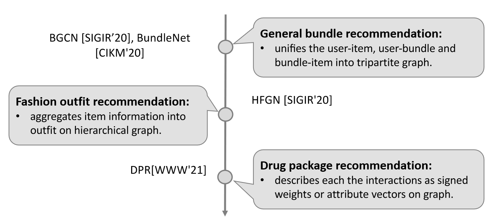

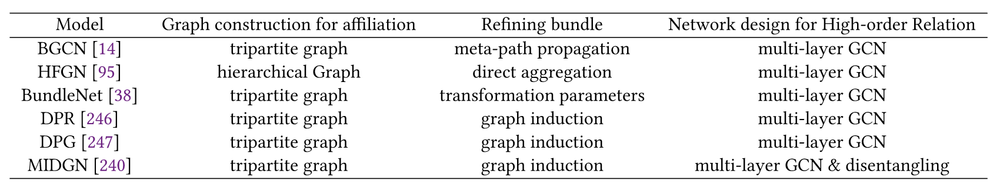

*   BGCN：提出了基于GNN的模型，该模型将两个部分的交互和捆绑item的从属关系统一到一个图中，那么该item就可以作为user-bundle和bundle-bundle之间进行嵌入传播的桥梁。同时，进一步提出了一种用于寻找难负样本的采样方式用于训练
*   DPR：提出用辅助数据初始化图，并将交互关系表示为标量权重和向量，提出了GNN层来获取药物包的嵌入
*   DPG：用所有bundle组成的图构建交互数据以获得bundle嵌入，并引入基于强化学习的新bundle生成目标
*   HFGN：构建了一个包含用户、item和服装的层次图。GNN层用于获取用户和服装的表示，GNN模型的学习遵循多任务方式
*   MIDGN：提出了一种结合去纠缠嵌入空间和多层嵌入传播，获得了更细粒度的用户对item和bundle的偏好

#### 跨域推荐

跨域推荐面临的挑战包括如何构建图和设计网络架构来跨域传递信息

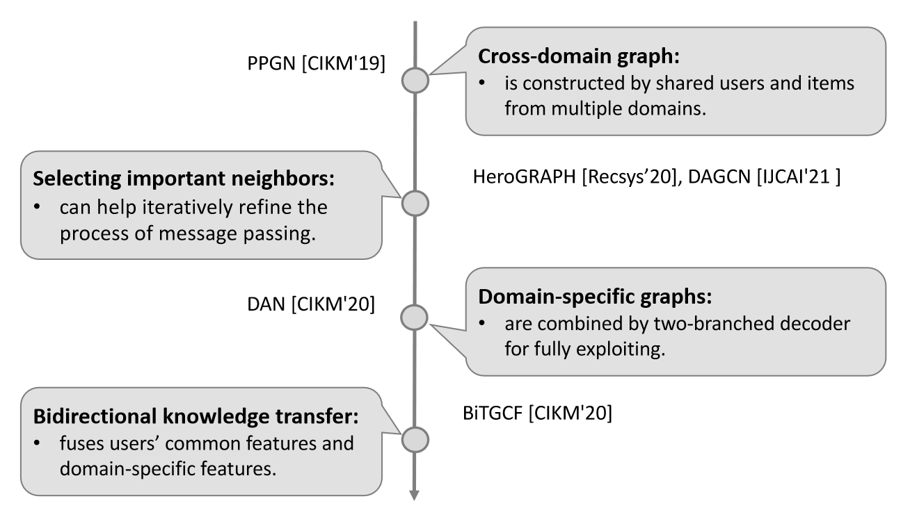

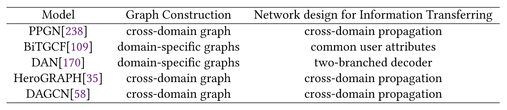

*   PPGN：使用在不同域之间共享的用户和item来构建跨域图，在多任务学习框架下，模型可以很好地学习到在多个域的item上用户的偏好
*   BiTGCF：提出了以共享用户为桥梁的双向知识转移。采用GNN层来利用user-item交互图中的高阶连通性来更好地进行偏好学习，然后将公共特征与特定领域特征进行融合
*   DAGCN：为每个领域构建图，并部署特定领域的GCN层来学习用户特定的嵌入，将其与注意力机制相结合，在嵌入传播过程中主动选择重要邻居
*   DAN：提出了encoder-decoder架构，使用GNN来实现encoder，将GCN部署在user-item图中
*   HeroGRAPH：提出构建一个异构图，其中多个域中的用户和item可以很好的包含在内，基于GNN的嵌入传播被部署在多个域上，其中一个用户/item可以直接吸收不同域的信息，使用循环注意力网络区分重要邻居

#### 多行为推荐

多种类型的行为可以为推荐系统提供大量的信息，有助于推荐系统进行更好地学习用户偏好，从而提高推荐性能

用户和item之间的多种类型行为自然可以建模为节点之间不同类型的边。因此，大多数基于GNN的多行为推荐方法都是基于异构图，需要关注两个因素

*   如何构建多种行为与目标行为的关系
*   如何通过行为构建item的语义

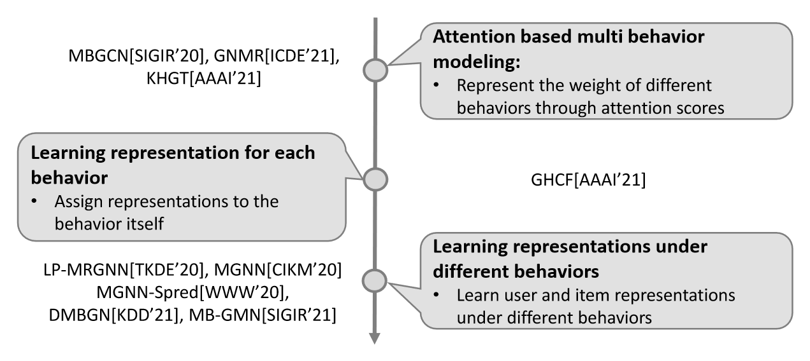

*   MGNN：在一个图中构建了所有的用户行为并进行图卷积操作
*   MGNN-SPred、LP-MRGNN：从图中提取每个行为作为子图，在子图中学习，最后通过门控机制进行聚合
*   GHCF：给用户、item和行为分配一个表示，在传播过程中，将边和邻居顶点的表示进行组合，得到新的顶点表示，通过组合过程，顶点的表示就融合了不同类型的行为信息
*   GNMR：重新设计了图卷积网络上的聚合机制来显式地建模不同类型行为的影响
*   MBGCN：为不同的边分配不同的可学习权重来建模行为的重要性
*   KHGT：学习不同行为空间中的表示，然后在表示中注入时间上下文信息来建模用户的行为动态，最后通过注意力机制，为预测目标判别最重要的关系和行为
*   MB-GMN：使用图元网络为不同的行为学习元知识，然后将学习到的元知识在不同类型的行为之间进行迁移
*   GNNH：除了将相关的item连接到图中，还构建item所属类别的图，用于增强item的表示

### Objective

#### Diversity

利用GNN增加多样性，要求学习到的用户嵌入接近于具有不同主题的item嵌入，但是由于GNN中的嵌入聚合操作，使得用户嵌入接近于历史记录中交互item的嵌入，GNN可能会通过推荐太多属于用户交互历史中主导主题的相似item来抑制多样性

多样性的两个挑战

*   弱偏好信号：通过从原始的user-item二部图中构建多样化的子图来限制主导主题的重要性
*   准确性和多样性的平衡

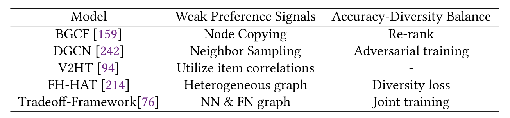

*   BGCF：通过对高阶邻居进行顶点复制，构建了扩充图，具有高相似度的多样化主题的item可以直接连接到用户顶点。根据item流行度对排名靠前的item进行重新排序
*   DGCN：进行了重新平衡的邻居采样，这样降低了优势主题的权重，增强了弱势主题在邻居顶点中的重要性。在item嵌入上使用对抗学习，使GNN捕获与item类别无关的用户偏好
*   V2HT：通过探索item在外部知识的相关性来构建一个item图，将多层GCN进行堆叠来提取长尾item，学习得到的长尾item融合了流行item的信息，可以提升长尾item的推荐
*   FH-HAT：FH-HAT通过建立一个异构图来表示不同用户的偏好，在图上计算邻居相似度的损失来平衡准确性和多样性
*   Tradeoff-Framework：在最近邻图和最远邻图上提出了两个GCN，其中NN保证了准确性，FN增强了不同item的弱信号，同时，两个GCN可以共同优化超参数来实现准确性和多样性的平衡

#### Explainability

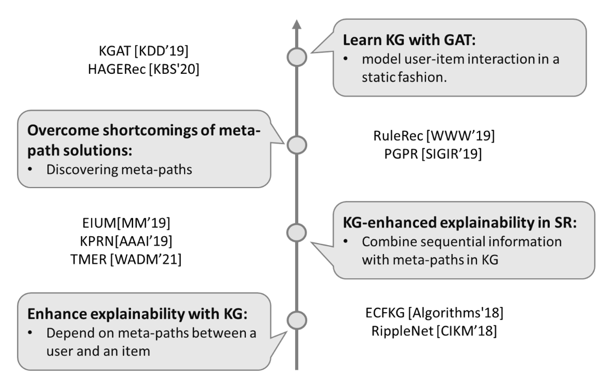

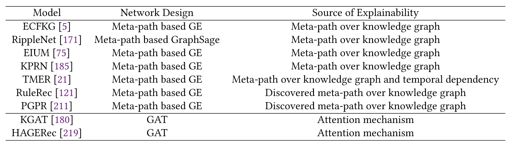

*   TriRank：构建一个包含三种顶点的异构图，顶点包含用户、item和aspect（从文本评论中提取的特定item属性），从而将推荐任务转换为三元关系排序任务，通过显式得构建评论中的aspect，模型具有高可解释性
*   ECFKG：使用user和item作为实体，用户交互行为作为关系，建立知识图谱，它们嵌入每个用于推荐的实体，并采用知识图谱中用户和item之间的最短关系路径来表示推荐解释
*   RippleNet：是一个end2end模型，将两个知识图谱感知的推荐方法结合起来，知识图谱中包含被推荐的item的相关知识，可以通过用户历史到高分item之间的路径生成解释
*   EIUM：从知识图谱中提取用户和item之间的语义元路径来帮助序列推荐，之后对元路径进行编码和排序，生成推荐列表，这些元路径也表明了各自的解释
*   KPRN：利用知识图谱来提高序列推荐任务的性能，并使用RNN来编码用户和item之间的元路径
*   TMER：通过神经网络捕获历史item特征和路径定义的上下文，进一步对时间元路径进行建模
*   RuleRec：从以item为中心的知识图谱中发现归纳规则(元路径)，使框架具有可解释性，并学习规则引导的推荐模型
*   PGPR：将可能的元路径枚举替换为强化推理方法，以识别适当的元路径，实现可扩展性
*   KGAT：使用注意力机制提供可解释性
*   HAGERec：开发了一个分层注意力图卷积网络来建模异构知识图谱中的高阶关系，其中可解释性也依赖于注意力机制

#### Fairness

尽管图数据在推荐中具有强大的力量，但它可能会继承甚至放大推荐中的歧视和社会偏见

过去的研究已经证明，与只采用节点属性的模型相比，由于使用了图结构，用户的不公平性被放大了

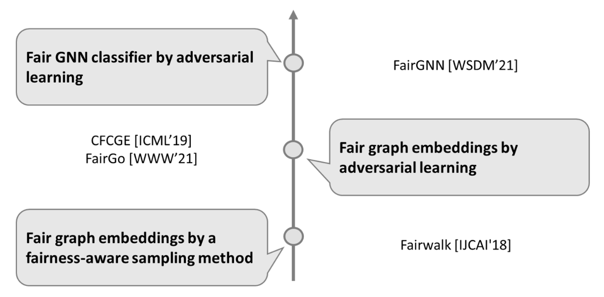

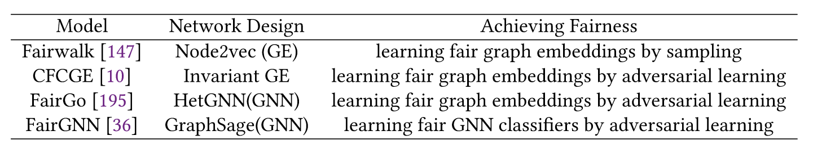

*   Fairwalk：扩展了图嵌入方法node2vec，它可以根据下一个顶点的敏感属性进行采样来生成更加多样化的网络邻域表示，用于社交推荐，因此，所有节点的敏感属性都是不可或缺的
*   CFCGE：提出了一个对抗架构来最小化图嵌入中的敏感信息，使用discriminator来施加公平限制，公平限制可以根据任务来变化
*   FairGo：使用基于图的对抗学习方法来将任何推荐模型中的嵌入映射到敏感信息过滤空间，从而消除了原始推荐嵌入和以用户为中心的图结构中潜在的泄露
*   FairGNN：在具有公平性约束的对抗学习范式中，学习具有有限已知敏感属性的公平GNN分类器，公平GNN分类器是为了保证顶点分类任务独立于敏感数据

### Application

*   电子商务

    *   Li等人提出堆叠多个GNN模块并使用确定性聚类算法来帮助提高GNN在大规模电子商务应用中的效率
    *   Liu等人提出利用物品关系的拓扑结构来构建电子商务推荐中的GNN

*   POI

    *   GGLR使用用户访问POI的序列来构建POI-POI图，其中POI之间的边表示用户连续访问两个POI的频率
    *   Zhang等人提出将社交网络和user-item交互结合在一起，在社交连接的用户和访问的兴趣点上都部署了嵌入聚合

*   新闻推荐

    *   Hu等人提出将偏好解耦引入到user-news嵌入传播中
