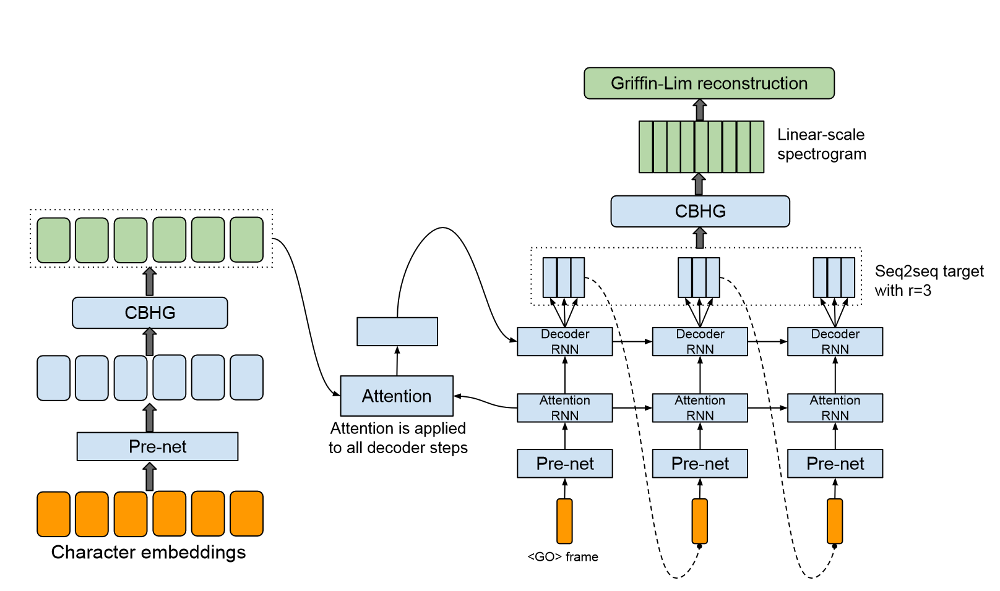
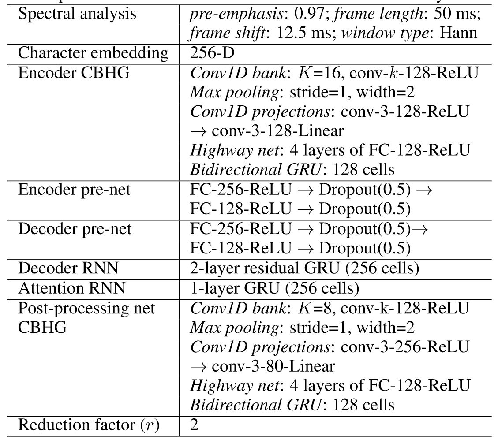
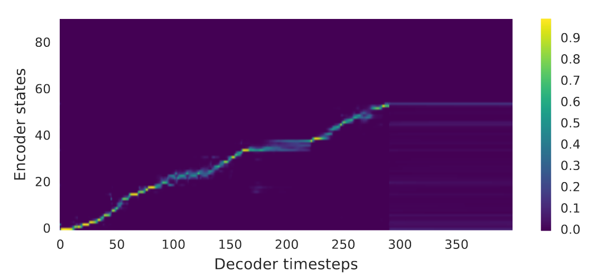
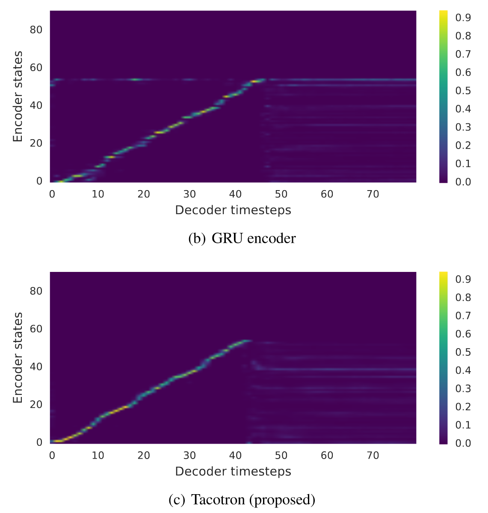
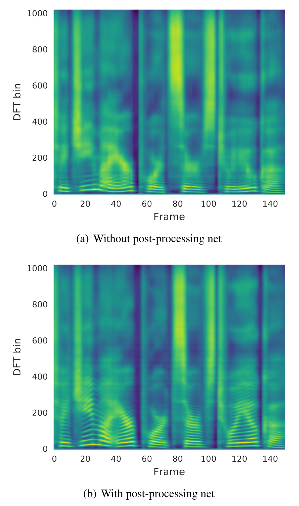
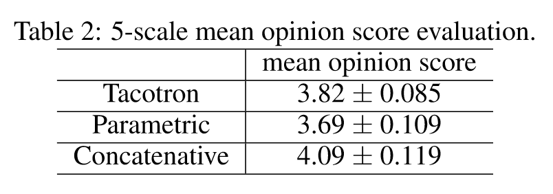

| 基本信息                                                     |
| ------------------------------------------------------------ |
| **期刊**: （发表日期: 2017-04-06）                           |
| **作者**: Yuxuan Wang; R. J. Skerry-Ryan; Daisy Stanton; Yonghui Wu; Ying Xiao; Zhifeng Chen; Samy Bengio; Quoc Le; Yannis Agiomyrgiannakis; Rob Clark; Rif A. Saurous |
| **摘要翻译**: 文语合成系统通常由多个阶段组成，如文本分析前端、声学模型和音频合成模块。构建这些组件通常需要广泛的领域专业知识，并且可能包含脆性的设计选择。在本文中，我们提出了一种端到端的生成式文本到语音模型Tacotron，该模型直接从字符合成语音。给定成对数据，模型可以在随机初始化的情况下完全从头开始训练。为了使序列到序列框架能够很好地完成这项具有挑战性的任务，我们提出了几个关键技术。Tacotron在美国英语上取得了3.82的主观五级平均意见分数，在自然度方面优于生产参数系统。此外，由于Tacotron在帧级别生成语音，因此它比样本级别的自回归方法要快得多。 |
| **期刊分区**:                                                |
| **原文PDF链接**: [Tacotron: Towards End-to-End Speech Synthesis](https://arxiv.org/abs/1703.10135) |

## 摘要

*   Tacotron是end2end的TTS模型，可直接从字符生成语音
*   给定\<text,audio>可直接开始训练
*   Tacotron以一个frame为单位生成语音，而不是以一个sample为单位，速度更快

## 前言及文献综述

### Introduction

以往的TTS模型的缺点

*   需要领域专业知识
*   难以设计
*   每个组件独立训练
*   误差组成复杂

整合的end2end模型的优势

*   减少特征工程的需求
*   支持丰富的条件影响，end2end的 条件影响发生在模型开始，而不是针对特定的组件
*   对数据的适应性更好
*   更加稳定

TTS问题

*   是一个inverse problem，本身难度大，必须要处理输入的多样性
*   TTS输出是连续的并且输出序列通常比输入更长

### Related Work

WaveNet

*   以sample为单位，太慢
*   不是end2end，需要TTS frontend获取语音特征的条件影响

DeepVoice

*   使用neural network替换了TTS的组件，然而每个network需要单独训练

Generating spectral parameters with neural attention

*   需要预训练的HMM来帮助训练alignment
*   有一些tricks不符合韵律学
*   需要训练一个vocoder
*   基于phoneme输入，结果受到限制

Char2Wav

*   在使用Sample RNN之前，需要训练vocoder的参数
*   seq2seq模型和Sample RNN需要单独预训练

## 结论

*   达到3.82MOS分数
*   不需要手动设计语音特征
*   不需要复杂组件
*   实现了简单的文本标准化，在未来可能是不必要的
*   输出层，Attention层，loss和基于Griffin-Lim的waveform生成器可以改进，例如，Griffin - Lim输出可能存在可听到的错误

## 方法

### 模型架构

*   分为Encoder、基于Attention的Decoder和后处理网络
*   接收字符作为输入，输出spectrogram frames，之后可将spectrogram转换为waveform

模型超参数

### CBHG模块

CBHG模块组成

*   Conv1D

    *   包含k组1-D convolutional filter，第k个filter的宽度为k，每组的filter个数为

        $C_k$

    *   将Convolution的结果stack后输出

    *   Batch Norm

    *   提取本地和上下文信息

*   Max-pool

    *   Max-Pool的stride为1
    *   沿时间维度最大池化，增强局部不变性

*   Conv1D projections、residual connection

    *   将宽度还原到原始输出，进行残差连接
    *   Batch Norm

*   Highway network

    *   提取高层次信息

*   Bidirectional GRU RNN

### Encoder

Encoder的输入是一串字符序列，每个字符被解释为一个one-hot向量，embed成一个连续值向量

对每个embedding进行一系列非线性变换，这些非线性变换称为prenet，prenet是一个带有dropout的bottleneck layer（瓶颈层）

bottleneck layer是指一个主要用于减少特征维度的模块，它可以是linear layer，也可以是convolution layer，此处的bottleneck layer是一个linear layer

经过pre-net后再经过CBHG，输入到attention中

### Decoder

在初始时输入一个全0的frame，称为go frame，每个time step输入一个frame，frame经过prenet后输入到Attention RNN，Attention RNN是一个GRU单元，输入frame和初始化的hidden state

Attention RNN产生Attention的query，Encoder的输出作为Attention的key，Attention的输出称为context vector，在每个time step中都使用Attention

Decoder RNN是一个GRU单元，输入context vector和初始化的hidden state，输出r个frame，即feature长度为r \* frame，取最后一个frame作为下一次的frame

将Decoder的输出经过一个postnet，将seq2seq的目标转换为waveform

### Postnet

Postnet模块是为了将seq2seq目标转换为waveform目标，模型中使用CBHG模块作为Postnet

### 模型训练

*   优化器：Adam

    lr初始为0.001，在500K步时减小到0.0005，在1M步时减小到0.0003，在2M步时减小到0.0001

*   损失函数：L1 Loss

    使用loss mask

## 实验

### 消融实验

与vanilla模型对比

Encoder和Decoder均使用2层残差RNN，其中每层有256个GRU单元，没有使用pre-net或post-net，decoder直接预测linear-scale log magnitude spectrogram，该模型需要预定采样(采样率0.5)来学习alignment和泛化

在向前移动之前，注意力往往会停留在许多帧上，这会导致合成信号中的语音可理解度很差

***

使用两层残差GRU替换CBHG

GRU编码器产生的alignment是嘈杂的，这些嘈杂的alignment导致了错误发音

***

不使用post-net和使用post-net对比

从后处理网络得到的预测包含了更好的可分辨谐波和高频共振峰结构，减少了合成伪影

### 平均意见得分测试（MOS）

受试者被要求对模拟的自然程度进行5点李克特量表评分，使用100个未见过的短语用于测试，每个短语获得8个评分，将Tacotron与parametric模型和concatenative系统对比

## 创新点

*   在Decoder输出时产生r个frame

    有助于减小模型大小、训练时间，同时可以大量增加收敛速度

    这可能是因为相邻的frame是有关联的，每个字符通常会对应到多个frame

*   dropout层在测试时也进行dropout

    音域使用类似scheduled sampling的技术会损坏音频质量，因此使用dropout层来模拟噪声，提高模型的泛化能力