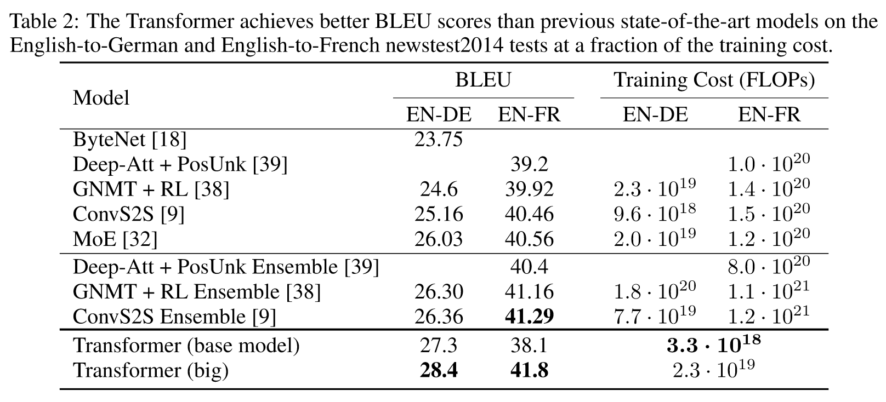

| 基本信息                                                     |
| ------------------------------------------------------------ |
| **期刊**: （发表日期: 2023-08-01）                           |
| **作者**: Ashish Vaswani; Noam Shazeer; Niki Parmar; Jakob Uszkoreit; Llion Jones; Aidan N. Gomez; Lukasz Kaiser; Illia Polosukhin |
| **摘要翻译**:占主导地位的序列转导模型是基于复杂的循环或卷积神经网络，包括编码器和解码器。性能最好的模型也通过注意力机制连接编码器和解码器。我们提出了一种新的简单的网络架构Transformer，它完全基于注意力机制，不需要递归和卷积。在两个机器翻译任务上的实验表明，这些模型在质量上具有优势，同时具有更高的可并行性，需要的训练时间显著减少。我们的模型在WMT 2014英德翻译任务上取得了28.4个BLEU，比包括集成在内的现有最好结果提高了2个BLEU以上。在WMT 2014英法翻译任务上，我们的模型在8个GPU上训练3.5 d后，建立了一个新的单模型最先进的BLEU评分为41.8，是文献中最好模型训练成本的一小部分。我们通过将Transformer成功地应用于具有大量和有限训练数据的英语选区解析，表明Transformer对其他任务具有良好的泛化能力。 |
| **期刊分区**:                                                |
| **原文PDF链接**: [Attention Is All You Need](https://arxiv.org/abs/1706.03762) |

## 摘要

*   以往的序列转换模型包含一个encoder和一个decoder，通常使用复杂的RNN或CNN，或使用attention连接encoder和decoder
*   Transformer完全依靠attention，不需要循环和卷积，具有更好的效果和更好的并行性
*   在WMT 2014 Englishto-German translation task上取得了28.4 BLEU评分，在WMT 2014 English-to-French translation task上取得了41.8 BLEU评分

## 前言及文献综述

### Introduction

*   RNN依赖前一个状态的固有顺序排除了并行化的可能性
*   Attention允许不考虑建模的依赖在输入输出序列中的距离
*   Transformer避免了递归，而是完全依赖Attention来构建输入和输出之间的全局依赖关系

### Background

*   在现有方法（Extended Neural GPU、ByteNet、ConvS2S）中，将来自两个任意输入或输出的词的信号关联起来所需的操作数量随词之间的距离呈线性增长
*   Transformer通过对词进行注意力加权后取平均值来将关联操作减少到一个恒定的数量，但这会降低有效分辨率，Transformer使用多头注意力来抵消这个影响
*   自注意力，有时称为帧内注意力，是一种将单个序列的不同词联系起来的注意力机制，用于计算序列的表示
*   基于循环注意力机制的end2end网络在简单语言问答和语言建模上相比非序列对齐的循环网络表现更好

## 结论

*   Transformer使用多头自注意力替换了encoder-decoder架构中的循环层
*   在未来，将会拓展Transformer除了文本和标签以外的输入和输出，同时限制注意力机制使其有效地处理图像、音频等大型输入

## 方法

### 模型架构

Transformer使用encoder-decoder架构，encoder将输入的完整符号序列映射到一个连续的特征表示，decoder根据这个特征表示，在每个时间步生成一个序列

模型是自回归的，不断使用之前产生的输出作为输入来生成下一个输出

### Encoder

Encoder由N（N=6）层相同的层组成，每一层包含两个子层

*   两个子层分别是一个多头自注意力机制和一个position-wise（对每个位置独立操作）的全连接层
*   每个子层都使用残差连接+LayerNorm（Add & Norm）
*   所有子层以及嵌入层的输出维度都是512

### Decoder

Decoder由N（N=6）层相同的层组成，每一层包含三个子层

*   Encoder的输出被输入到Decoder的多头自注意力中（这个Attention后文称作encoder-decoder attention）
*   每个子层都使用残差连接+LayerNorm（Add & Norm）
*   在第一个多头自注意力中使用mask，保证在预测第i个词时，只依赖之前的词

### LayerNorm

对于一个多维的张量，沿着不同的轴进行Normalization会产生不同的效果，主要有两种

*   BatchNorm：批标准化
*   LayerNorm：层标准化

假设一个二维矩阵$A\in\mathbb{R}^{batch\times feature}$，BatchNorm就是在每个feature上进行标准化，消除了不同特征之间的差异，LayerNorm则是在每个batch上进行标准化，消除了不同样本之间的差异

拓展到三维，图示如下

对于NLP任务，输入形状通常为(batch, length, feature)，同时每个句子都有不同的长度，通过padding填充到相同长度。此时如果使用BatchNorm，就消除了特征之间的差异，即上下文之间的差异，不符合NLP任务的特点，使用LayerNorm可以消除不同句子之间的差异性，保持了上下文的差异

### Attention

Attention使用三个向量query、key、value，它的输出是value的加权求和，其中的权重也称为注意力权重，注意力权重由query和key计算得到

#### Scaled Dot-Product Attention

query和key的特征维度大小为$d_k$，value的特征维度大小为$d_v$，将所有的key与query做点积（Dot-Product），除以$\sqrt{d_k}$进行缩放，之后进行softmax得到注意力权重，将权重与value进行加权求和得到输出

将N个query组成矩阵$Q\in\mathbb{R}^{N\times d_k}$，所有的key组成矩阵$K\in\mathbb{R}^{M\times d_k}$，所有的value组成矩阵$V\in\mathbb{R}^{M\times d_v}$，有

$$
Attention(Q,K,V)=softmax(\frac{QK^T}{\sqrt{d_k}})V
$$

最常用的注意力机制有两种

*   Dot-Product Attention（点积注意力）：与上述的Attention基本相同，除了不进行缩放
*   Additive Attention（加性注意力）：直接将Q和K相加，再经过一个$\tanh$激活

以上两种注意力机制在理论上具有相似的复杂度，但Dot-Product在实践上效果更好，更易于优化

当维度$d_k$较小时，两种注意力表现相似，当$d_k$较大时，Dot-Product的一些结果值会变大，而一些结果值可能很小，相对的差距变大，导致softmax的梯度变得极小，因此使用缩放来抵消这种影响

#### Multi-Head Attention

将Attention堆叠h层，每一层在输入Q、K、V时，都分别经过一个可学习的线性层，每一层的Attention计算是并行的，产生特征维度为$d_v$的输出，将h个输出拼接后输入到一个线性层产生最终输出

多头自注意力可以考虑到不同位置上的不同的表示子空间的信息，同时由于多头的注意力计算是并行的，因此总的计算成本与单头注意力加一个线性层的总成本相似

设Q、K、V的线性层权重分别为$W^Q\in\mathbb{R}^{d_{model}\times d_k}$，$W^K\in\mathbb{R}^{d_{model}\times d_k}$，$W^V\in\mathbb{R}^{d_{model}\times d_v}$，最终线性层的权重为$W^O\in\mathbb{R}^{hd_v\times d_{model}}$，有

$$
\begin{aligned}
MultiHead(Q,K,V)&=Concat(head_1,…,head_h)W^O\\
where\quad head_i&=Attention(QW^Q_i,KW^K_i,VW^V_i)
\end{aligned}
$$

在实验中，设置$h=8$，$d_k=d_v=\frac{d_{model}}{h}=64$

#### Attention在模型中应用

*   Encoder的输出作为key和value输入到encoder-decoder attention中，Decoder在encoder-decoder attention之前的输出作为query输入，这使得Decoder的输出考虑了Encoder的序列信息

*   在Encoder中，通过多头自注意力机制，输出的每个词的表示就融合了整个序列内的相似度权重

*   Decoder的第一层多头自注意力使用了mask，用于保证输出第i个词时只依赖之前的词

    输入到Decoder的outputs是完整的结果序列，由于Attention会使用输入的整个序列进行计算，而Decoder在输出第i个词时不应该考虑第i个词之后的词，因此需要进行mask

    Masked Attention在进行缩放后，设置mask部分为一个极小的负数，之后softmax在mask部分的输出就是0，实现了mask的效果

### Position-wise Feed-Forward Network

Transformer中使用的FFN是Position-wise，也就是对每个位置（词）独立进行操作，其中包含两个线性变换，隐层使用ReLU激活

$$
FFN(x)=\max (0,xW_1+b_1)W_2+b_2
$$

模型中设置输入和输出维度为512，隐层的维度为2048

### Embeddings and Softmax

在输入inputs和outputs时使用Embedding将token序列转换成向量，在Decoder输出后使用一个线性层+Softmax输出下一个token的概率

两个Embedding层和Softmax之前的线性层共享相同的权重，同时，在Embedding层，对权重乘以$\sqrt{d_{model}}$

### Positional Encoding

在Attention中不会涉及到序列的顺序信息，因此需要在Embedding后加上序列的位置编码，位置编码就是使用一个向量来表示词的位置

在Transformer中使用以下位置编码

$$
\begin{aligned}
PE_{(pos,2i)}&=\sin(pos/10000^{2i/d_{model}})\\
PE_{(pos,2i+1)}&=\cos(pos/10000^{2i/d_{model}})
\end{aligned}
$$

其中，pos表示词的位置，i表示第i个特征，对所有词的每个特征就对应了一条正弦曲线，之所以选择这个函数，是因为对于任意偏移量k，$PE_{pos+k}$都可以表示成$PE_{pos}$的线性函数，可以很容易的学习到相对位置信息

## 为什么使用Self-Attention

从三个方面进行比较

*   计算复杂度
*   计算并行度：通过串行操作的数量来衡量
*   网络中长依赖关系的路径长度：通过任意两个输入和输出位置之间的最大路径长度来衡量

*   在并行度上，Self-Attention的串行操作数量恒定，而RNN的串行操作数量为$O(n)$，这一点上Self-Attention相比RNN更快

*   Self-Attention的计算复杂度随$n^2$增长，为了提高性能，可以将Self-Attention限制为仅考虑输入序列中以输出位置为中心的大小为r的邻域

*   对于核大小k小于序列长度n的CNN，需要堆叠$n/k$个CNN来获取整个序列的信息，这会增加网络中的最长路径长度

## 实验

### 训练

使用数据集WMT 2014 English-German dataset和WMT 2014 English-French dataset进行英语-德语和英语-法语的机器翻译任务

优化器：Adam，设置参数$\beta_1=0.9$，$\beta_2=0.98$，$\epsilon=10^{-9}$

学习率：使用如下公式计算

$$
lrate=d^{-0.5}_{model}\cdot\min(step\_num^{-0.5},step\_num\cdot warmup\_steps^{-1.5})
$$

其中，warmup\_steps设为4000

正则化

*   Residual Dropout：将dropout应用于每个子层的输出，然后将其添加到子层输入并归一化。此外，将dropout应用于Encoder和Decoder中的嵌入和位置编码的总和。对于基本模型，使用丢弃率$P_{drop}=0.1$

*   Label Smoothing：在训练过程中，使用了$\epsilon_{ls}=0.1$的标签平滑

### 实验结果

### 模型超参数

*   A行比较不同的自注意力头的个数、$d_k$、$d_v$，自注意力头的个数过多和过少都会降低性能

*   B行比较不同的$d_k$值，不同的$d_k$会影响性能，确定注意力的compatibility function并不容易

*   C行和D行表明更大的模型有更好的性能，并且dropout可以有效地避免过拟合

*   E行比较正弦位置编码和可学习的位置嵌入，表明二者的性能几乎相同
