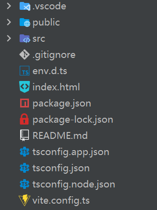

## 开始

通过Vite创建Vue项目，命令为`npm create vue@latest`，再运行`npm i`安装依赖

项目目录结构



-   public：存放项目公共资源
-   src：源代码目录
-   `env.d.ts`：ts环境文件，识别项目中的文件
-   `index.html`：项目入口
-   `package.json`：依赖管理文件
-   `tsconfig.app.json`、`tsconfig.json`、`tsconfig.node.json`：ts配置文件
-   `vite.config.ts`：项目配置文件

## App组件

`App.vue`是项目的根组件，在`main.ts`中实现将组件挂载到`index.html`的元素

`index.html`中包含一个id为app的div元素

```html
<body>
    <div id="app"></div>
    <script type="module" src="/src/main.ts"></script>
</body>
```
{: file='index.html'}

在`main.ts`中将App组件挂载到app元素上

```ts
import './assets/main.css'

import { createApp } from 'vue'
import App from './App.vue'

createApp(App).mount('#app')
```
{: file='src/main.ts'}

## 单文件组件

Vue的单文件组件是指在一个文件中编写一个组件，文件后缀为`.vue`，该文件中封装了组件的HTML、CSS和JavaScript代码

单文件组件的基本结构

```vue
<template>
<!--编写HTML-->
</template>

<script>
// 编写JavaScript
</script>

<style scoped>
/* 编写CSS */
</style>
```

## 选项式API与组合式API

选项式API使用一个对象来描述组件，通过定义对象中的特定名称的方法来配置组件的逻辑

```vue
<script>
// 默认导出一个对象，代表组件实例
export default {
  // 配置状态
  data() {
    return {
      count: 0
    }
  },

  // 配置方法修改状态
  methods: {
    increment() {
      this.count++
    }
  },

  // 生命周期回调
  mounted() {
    console.log(`The initial count is ${this.count}.`)
  }
}
</script>

<template>
  <button @click="increment">Count is: { { count } }</button>
</template>
```

组合式API使用导入的API函数来描述组件逻辑，将相关的逻辑放在一起，更易于维护

```vue
<script setup>
import { ref, onMounted } from 'vue'

// 定义状态
const count = ref(0)

// 用来修改状态、触发更新的函数
function increment() {
  count.value++
}

// 生命周期钩子
onMounted(() => {
  console.log(`The initial count is ${count.value}.`)
})
</script>

<template>
  <button @click="increment">Count is: { { count } }</button>
</template>
```

