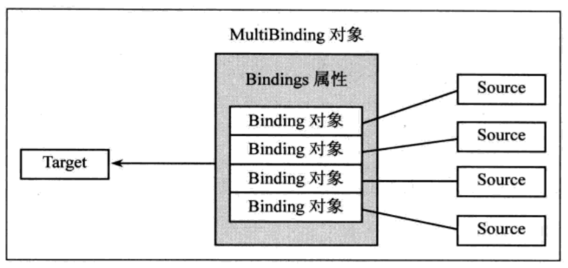

## 开始

Binding对象是实现数据和界面双向绑定的基础

在数据部分，数据源需要实现`INotifyPropertyChanged`接口，其中包含一个`PropertyChangedEventHandler`类型的`PropertyChanged`属性，该属性是一个事件，当数据源内的属性变化时，需要调用`PropertyChanged`来触发属性变化事件，从而能够通知到UI改变数据

数据源的基本实现如下

```c#
public class Student : INotifyPropertyChanged {

    public event PropertyChangedEventHandler? PropertyChanged;

    private string name = "";
    public string Name {
        get => name;
        set {
            name = value;
            // 当Name被修改时，触发事件
            // 注意这里传入Name属性而不是name字段，因为外部通过Name属性来访问name字段
            PropertyChanged?.Invoke(this, new("Name"));
        }
    }
}
```

编写一个简单布局，在后台类中通过C#代码的方式将`Student`类的`Name`属性绑定到文本框中（也可使用标签扩展），xaml布局如下

```xml
<StackPanel 
    Orientation="Vertical"
    VerticalAlignment="Center">
    <TextBlock
    	Width="250"
        Height="50"
        Margin="30, 0"
        x:Name="MyText"/>
    <Button
        Width="250"
        Height="50"
        Margin="30, 0"
        x:Name="Button"
        Content="Click Me"/>
</StackPanel>
```

后台类如下

```c#
public partial class MainWindow : Window {
    public MainWindow() {
        InitializeComponent();

        var student = new Student();
        // 数据源就是Student对象，路径Path就是属性的访问器，即Name属性
        var binding = new Binding() {
            Source = student,
            Path = new PropertyPath("Name")
        };

        // 将Student的Name属性绑定到TextBlock的Text属性上
        BindingOperations.SetBinding(MyText, TextBlock.TextProperty, binding);
        // 基于FrameworkElement的元素也就是基本元素对SetBinding进行了封装，也拥有SetBinding方法
        // MyText.SetBinding(TextBlock.TextProperty, binding);

        // 设置Click事件
        Button.Click += (_, _) => student.Name = "Hello";
    }
}
```

>   上述Binding对象的`Source`属性可以接收任何对象，若对象没有实现`INotifyPropertyChanged`接口，则无法向Binding通知自身的状态变化，`INotifyPropertyChanged`提供了对象向Binding通知自身变化的能力
{: .prompt-info }

## Binding属性

Binding对象的常用属性如下

| 属性名             | 描述                                                         |
| ------------------ | ------------------------------------------------------------ |
| AsyncState         | 获取或设置传递给异步数据调度程序的不透明数据。               |
| BindingGroupName   | 获取或设置此绑定所属的BindingGroup的名称                     |
| Converter          | 获取或设置要使用的转换器                                     |
| ConverterParameter | 获取或设置要传递给Converter的参数                            |
| Delay              | 获取或设置更新位于目标更改上的值之后的绑定源前要等待的时间（毫秒） |
| ElementName        | 获取或设置要用作绑定源对象的控件元素的名称                   |
| FallbackValue      | 获取或设置当绑定无法返回值时要使用的值                       |
| IsAsync            | 获取或设置一个值，该值表示Binding是否应异步获取和设置值      |
| Mode               | 获取或设置一个值，该值指示绑定的数据流方向                   |
| Path               | 获取或设置绑定源属性的路径                                   |
| RelativeSource     | 通过指定绑定源相对于绑定目标位置的位置，获取或设置此绑定源   |
| Source             | 获取或设置要用作绑定源的对象                                 |
| StringFormat       | 获取或设置一个字符串，该字符串指定如果绑定值显示为字符串时如何设置该绑定的格式 |
| TargetNullValue    | 获取或设置当源的值为 `null` 时在目标中使用的值               |

## 数据流向

通过设置Binding对象的`Mode`属性可以改变Binding数据的流向，`Mode`属性是`BindingMode`类型，拥有四个枚举值

-   OneWay：单向流动
-   TwoWay：双向流动，默认值
-   OnTime
-   OneWayToSource
-   Default：根据控件的读写属性确定单向或双向

## Path路径

Path属性指定绑定的数据源属性

-   直接路径：直接指定属性名

    ```xml
    <!--通过标签扩展引用其他元素的属性-->
    <TextBlock Text="Hello World" x:Name="MyText"></TextBlock>
    <TextBlock Text="{Binding ElementName=MyText, Path=Text}"></TextBlock>
    ```

-   多级路径：可以获取属性的属性

    ```xml
    <!--通过标签扩展引用其他元素的属性-->
    <TextBlock Text="Hello World" x:Name="MyText"></TextBlock>
    <!--Path指向Text的Length属性-->
    <TextBlock Text="{Binding ElementName=MyText, Path=Text.Length}"></TextBlock>
    <!--使用Text的索引器，点.可以省略-->
    <TextBlock Text="{Binding ElementName=MyText, Path=Text.[0]}"></TextBlock>
    ```

-   默认路径：当绑定的数据源自身就是数据值时，使用默认路径

    当数据源是一个集合时，使用`/`表示第一个元素的默认路径

    ```xml
    <Window.Resources>
        <sys:String x:Key="MyValue">Hello</sys:String>
    </Window.Resources>
    <TextBlock Text="{Binding ., Source={StaticResource MyValue}}"/>
    <!--等价于-->
    <TextBlock Text="{Binding Path=., Source={StaticResource ResourceKey=MyValue}}"/>
    ```

## 数据源

Binding指定数据源主要通过`Source`属性，下面介绍通过不同的途径设置Binding数据源

### CLR属性和依赖属性

CLR属性就是普通对象的普通属性，与依赖对象的依赖属性区分

依赖对象继承了`DependencyObject`类，依赖属性为`DependencyProterty`类型，命名后缀通常是Property，在xaml中引用时会省略该后缀。依赖属性是依赖其他属性的属性，如控件的可绑定属性，通常作为Binding的目标

同时依赖对象也可作为Binding的源，当作为Binding源时，该依赖对象可能是其他Binding的目标，从而形成依赖链

### DataContext

Binding将`DataContext`的值作为数据源，`Path`属性指定数据源中的属性

```xml
<!--可以省略点.-->
<Label Content="{Binding Path=.}">
    <Label.DataContext>
        Hello
    </Label.DataContext>
</Label>
```

`DataContext`是`FrameworkElement`的属性，是`object`类型，每个控件都拥有自己的`DataContext`，`DataContext`是一个依赖属性，当控件的`DataContext`没有显式赋值时，会依赖父控件的`DataContext`，因此当Binding指定路径时，可以自动获取到父控件或祖先控件的`DataContext`中的属性

```xml
 <StackPanel>
    <StackPanel.DataContext>
        <sys:Int32>32</sys:Int32>
    </StackPanel.DataContext>
    <Label Content="{Binding Path=.}"></Label>
</StackPanel>
```

### 集合类型

ItemsControl控件拥有`ItemsSource`属性，接收一个实现`IEnumerable`接口的对象作为数据源

`DataTemplate`类定义了单个子项数据通过哪些控件展示，`DataTemplateSelector`类的子类重写了`SelectTemplate`方法，实现了子项数据与控件的绑定（创建Binding对象），再使用`DataTemplate`将添加Binding的控件对象包装起来返回

```c#
public virtual DataTemplate SelectTemplate(object item, DependencyObject container) {
    // ...
}
```

默认的`DataTemplateSelector`是`DisplayMemberTemplateSelector`，它的`DisplayMemberPath`属性指定了数据源成员的路径，简单地将数据源成员通过`TextBlock`控件展示为一个字符串，其核心代码如下

```c#
// 初始化DataTemplate和控件对象
_clrNodeContentTemplate = new DataTemplate();
FrameworkElementFactory text = ContentPresenter.CreateTextBlockFactory();
// 创建Binding并设置
Binding binding = new Binding();
binding.Path = new PropertyPath(_displayMemberPath);
binding.StringFormat = _stringFormat;
text.SetBinding(TextBlock.TextProperty, binding);
// 由DataTemplate包装后返回
_clrNodeContentTemplate.VisualTree = text;
_clrNodeContentTemplate.Seal();
```

在xaml中可以给ItemsControl自定义`DataTemplate`，赋值给`ItemTemplate`属性

```xml
<ListBox
	x:Name="StudentList"
	Height="Auto">
	<ListBox.ItemTemplate>
		<DataTemplate>
			<Label Content="{Binding Path=Name}"/>
		</DataTemplate>
	</ListBox.ItemTemplate>
</ListBox>
<!--在C#中指定ItemsSource-->
<!--StudentList.ItemsSource = list;-->
```

### ElementName

`ElementName`设置为其他控件的`x:Name`，将被引用的控件对象作为Binding源

```xml
<TextBlock Text="Hello" x:Name="Hello"/>
<Label Content="{Binding ElementName=Hello, Path=Text}"></Label>
```

### RelativeResource

相对于当前元素，查找其他元素的属性

构造`RelativeSource`对象赋值给Binding的`RelativeSource`属性，将`RelativeSource`查找的元素作为源

-   Mode：查找模式，FindAncestor查找祖先，Self查找自身
-   AncestorLevel：确定祖先相对层级
-   AncestorType：确定祖先控件类型，通过`x:Type`获取`Type`类型

```xml
<StackPanel 
    Orientation="Vertical"
    VerticalAlignment="Center"
    Background="Red">
    <TextBlock
        Text="{
            Binding 
                RelativeSource={
                RelativeSource 
                Mode=FindAncestor,
                    AncestorLevel=1, 
                    AncestorType={x:Type StackPanel}
                }, 
            Path=Background
        }"/>
</StackPanel>
```

### 其他数据源

-   `ADO.NET`类型对象

    DataTable、DataView等

-   XML数据

    通过`XmlDataProvider`将xml中的数据传递给集合控件数据源属性

-   `ObjectDataProvider`

    当数据通过方法获取时，使用`ObjectDataProvider`包装数据源，再赋给Source

## 数据校验

### 基本使用

Binding对象包含一个`ValidationRules`属性，类型为`Collection<ValidationRule>`，表示可以对一个Binding设置多个校验条件

`ValidationRule`是一个抽象类，包含一个`Validate`抽象方法，返回`ValidationResult`对象

```c#
public class RangeValidation : ValidationRule {

    public override ValidationResult Validate(object? value, CultureInfo cultureInfo) {
        var num = (int)(value ?? throw new ArgumentNullException(nameof(value)));
        if (num > 0) {
            // 第二个参数为错误信息
            return new ValidationResult(true, null);
        } else {
            return new ValidationResult(false, "num < 10");
        }
    }
}

// 添加到ValidationRules中
binding.ValidationRules.Add(new RangeValidation());
```

>   Binding校验默认只校验通过外部方法改变Target导致Source改变，不会校验Source改变导致Target改变，设置`ValidatesOnTargetUpdated`属性为true，校验Source导致的改变
{: .prompt-tip}

### 校验错误事件

若需要Binding在校验错误时发出一个事件，需要设置`NotifyOnValidationError`属性为true

校验错误事件会沿着元素树传播，当遇到一个元素设置了校验错误事件处理器，则该元素处理该事件，处理后可继续传播，也可立即停止

```c#
// 定义事件处理器
void ValidateError(object sender, RoutedEventArgs e) {
    // 判断是否有校验错误
    if (Validation.GetHasError(MyText)) {
        // 获取校验错误信息
        var message = Validation.GetErrors(MyText)[0].ErrorContent.ToString(); 
    }
}

// 设置事件处理器
MyTextBlock.AddHandler(Validation.ErrorEvent, new RoutedEventHandler(ValidateError));
```

## 数据转换

数据转换通过`IValueConverter`实现类实现

```c#
public class MyConverter : IValueConverter {

    public object Convert(object? value, 
                          Type targetType, 
                          object? parameter, 
                          CultureInfo culture) {
        // Source转换为Target
    }

    public object ConvertBack(object? value, 
                              Type targetType, 
                              object? parameter, 
                              CultureInfo culture) {
        // Target转换为Source
    }
}

```

## MultiBinding

MultiBinding组合多个Binding的Source，绑定到一个Target

MultiBinding支持Binding的基本属性，如`StringFormat`、`Mode`、`Converter`等



组合字符串的基本使用，xaml标签扩展

```xml
<TextBlock x:Name="MyText">
    <TextBlock.Text>
        <MultiBinding StringFormat="Binding1：{}，Binding2：{}">
            <Binding />
            <!--other bindings-->
        </MultiBinding>
    </TextBlock.Text>
</TextBlock>
```

多值转换：实现`IMultiValueConverter`转换多个Source

```c#
public class MultiConverter : IMultiValueConverter {

    public object Convert(object[] values, Type targetType, object parameter, CultureInfo culture) {
        // Sources转换为Target
    }

    public object[] ConvertBack(object value, Type[] targetTypes, object parameter, CultureInfo culture) {
        // Target转换为Sources
    }
}

```

