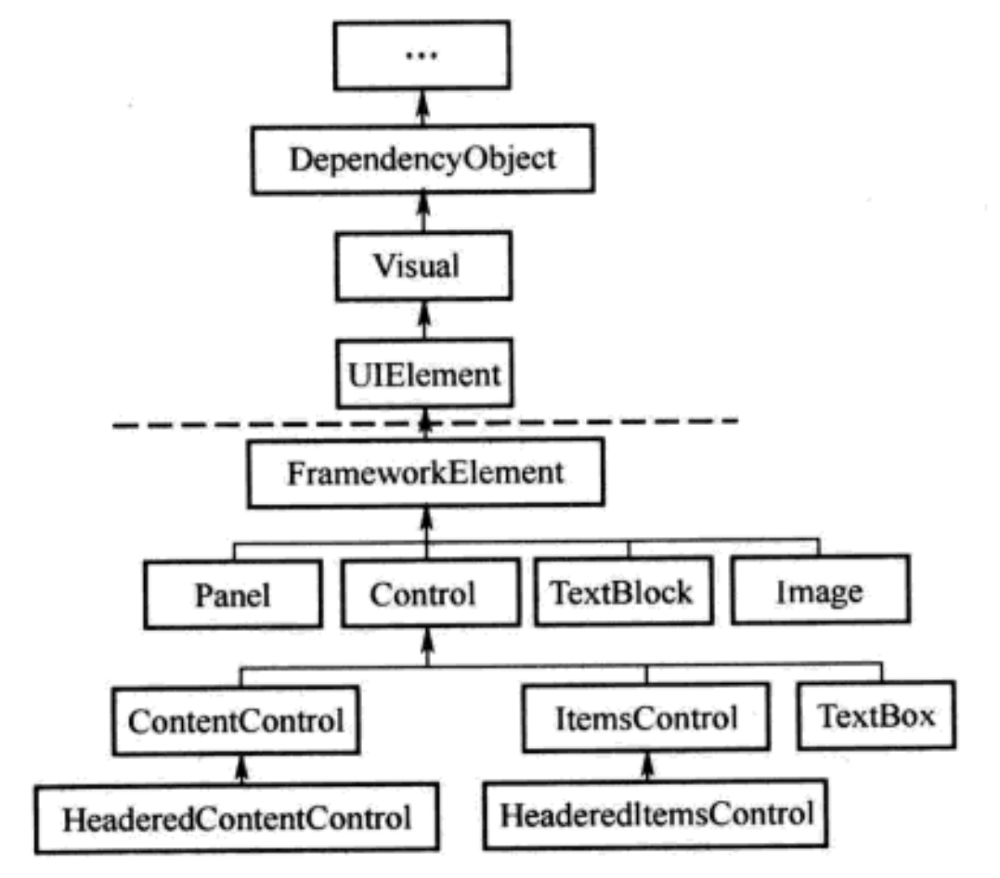

## 开始

WPF中的控件主要分为6类控件，分别是布局控件、内容控件、带标题内容控件、集合控件、带标题集合控件、特殊内容控件，这些控件类的继承关系如下



-   ContentControl：单一内容控件
-   HeaderedContentControl：带标题单一内容控件
-   ItemsControl：以集合为内容的控件
-   HeaderedItemsControl：带标题的以条目集合为内容的控件
-   Decorator：控件装饰元素
-   Panel：面板类控件
-   TextBox：文本输入框
-   TextBlock：静态多行文本
-   Shape：图形元素

每个控件都有一个属性用于引用内部的子控件对象，该属性称为内容属性，有些控件内容属性是`Content`，有些是`Children`，有些是`Items`，控件标签内部区域专门映射了控件的内容属性

```xml
<Button>
    Hello
</Button>
<!--相当于-->
<Button Content="Hello"></Button>
```

## 控件族

### ContentControl

内容属性是`Content`，内容只能包含一个子元素，若需要包含多个元素，可以使用一个容器元素包装多个元素放入内容

-   Button：简单按钮
-   ButtonBase：所有按钮类控件的父类
-   CheckBox：复选框
-   ComboBoxItem：下拉列表项，ComboBox的子项容器
-   Frame：支持导航的内容控件，可导航到其他xaml窗口
-   GridViewColumnHeader：GridViewColumn的标题
-   GroupItem：GroupBox子项容器
-   Label：简单文本标签
-   ListBoxItem：ListBox子项容器
-   ListViewItem：ListView子项容器
-   NavigationWindow：支持导航的Window，继承自Window
-   RadioButton：单选框
-   RepeatButton：在按下时重复触发事件的按钮
-   ScrollViewer：包含其他元素的可滚动区域
-   StatusBarItem：StatusBar子项容器
-   ToggleButton：可切换状态的按钮父类
-   ToolTip：工具信息提示
-   UserControl：继承该类自定义控件
-   Window：窗口区域

### HeaderedContentControl

该族继承自ContentControl，除了`Content`属性还包含`Header`属性用于显示标题，`Header`只能接收一个子元素

主要包含以下元素

-   Expander：带标题的可折叠内容区域
-   GroupBox：带标题和边框的内容区域
-   TabItem：TabControl的子项容器

### ItemsControl

内容属性为`Items`或`ItemsSource`，每个集合容器都有对应的子项容器，如`ListBoxItem`、`ListViewItem`

主要包含以下元素

-   Menu：菜单
-   MenuBase：菜单父类
-   ContextMenu：右键上下文菜单
-   ComboBox：下拉列表
-   ListBox：可选项列表
-   ListView：数据项列表，相比ListBox提供更多自定义选项
-   TabControl：包含多个标签页
-   TreeView：树形结构列表
-   Selector：包含多个子元素，为子元素提供可选择能力
-   StatusBar：状态栏

ItemsControl会对内容中的单个元素自动使用子项容器进行包装

```xml
<ListBox>
    <Button></Button>
    <Button></Button>
</ListBox>
<!--相当于-->
<ListBox>
    <ListBoxItem>
        <Button></Button>
    </ListBoxItem>
    <ListBoxItem>
        <Button></Button>
    </ListBoxItem>
</ListBox>
```

ItemsControl对应的子项容器如下

| ItemsControl | Item Container |
| ------------ | -------------- |
| ComboBox     | ComboBoxItem   |
| ContextMenu  | MenuItem       |
| ListBox      | ListBoxItem    |
| ListView     | ListViewItem   |
| Menu         | MenuItem       |
| StatusBar    | StatusBarItem  |
| TabControl   | TabItem        |
| TreeView     | TreeViewItem   |

### HeaderedItemsControl

内容属性为`Items`、`ItemsSource`、`Header`

主要包含以下元素

-   MenuItem：菜单项
-   TreeViewItem：树形列表项
-   ToolBar：工具栏

### Decorator

内容属性为`Child`，对元素起装饰作用，只能有一个元素作为内容

主要有以下元素

-   ButtonChrome
-   ClassicBorderDecorator
-   ListBoxChrome
-   SystemDropShadowChrome
-   Border
-   InkPresenter
-   BulletDecorator
-   Viewbox
-   AdornerDecorator

### Panel

内容属性为`Children`，内容可包含多个元素

主要有以下元素

-   Canvas：画布
-   DockPanel：停靠布局
-   Grid：网格布局
-   TabPanel：标签页布局
-   ToolBarOverflowPanel：可溢出的ToolBar布局
-   StackPanel：栈式布局
-   ToolBarPanel：ToolBar布局
-   UniformGrid：均分网格布局
-   WrapPanel：换行布局

## 控件通用属性

-   基本属性

    -   Width
    -   Height
    -   Visibility：控件是否可见

    Width和Height支持`px`、`in`、`cm`、`pt`四种单位，支持三种方式赋值

    -   绝对值：默认单位为`px`
    -   比例值：在数值后加一个`*`，数值为占用比例
    -   自适应：`Auto`

-   颜色样式

    -   Foreground：控件文本颜色
    -   Background：控件背景色
    -   Opacity：不透明度
    -   Clip：用于定义控件的裁剪区域的几何形状

-   字体

    -   FontFamily
    -   FontSize
    -   FontStretch
    -   FontStyle
    -   FontWeight

-   边框

    -   BorderBrush：边框颜色
    -   BorderThickness：边框宽度

-   布局

    -   Margin
    -   Padding
    -   HorizontalAlignment：在父容器中的水平对齐方式
    -   VerticalAlignment：在父容器中的垂直对齐方式

-   交互

    -   IsEnabled：是否允许控件响应
    -   Name：控件唯一标识符
    -   Focusable：是否可获取焦点
    -   ContextMenu：右键点击时的上下文菜单
    -   ToolTip：当鼠标悬停在控件上时显示的提示信息
    -   Cursor：当鼠标悬停在控件上时显示的鼠标光标类型

## 布局控件

-   **Grid网格布局**
    -   可以定义任意数量的行列

    -   行列大小可以使用绝对数值、自适应、相对比例

    -   行列可以设置跨行跨列，使用`RowSpan`或`ColumnSpan`附加属性

    -   可设置`Children`元素的对齐方向
    -   结合`GridSplitter`可实现拖拽分隔栏动态改变行高列宽

-   **StackPanel栈式布局**
    -   支持水平、垂直方向布局

    -   Orientation：设置布局方向

    -   HorizontalAlignment：设置子元素的水平对齐

    -   VerticalAlignment：设置子元素的垂直对齐

-   **Canvas画布**
    -   为子元素附加`X`、`Y`属性，支持子元素的绝对点定位

-   **DockPanel停靠布局**
    -   为子元素附加`Dock`属性，拥有`Left`、`Top`、`Right`、`Bottom`四个值，子元素会根据`Dock`属性停靠到对应的边界
    -   由于`LastChildFill`属性默认值为True，因此最后一个子元素会填满`DockPanel`中的剩余空间

-   **WrapPanel流式布局**
    -   与StackPanel类似，当子元素超过一行或一列时，会自动换行换列

